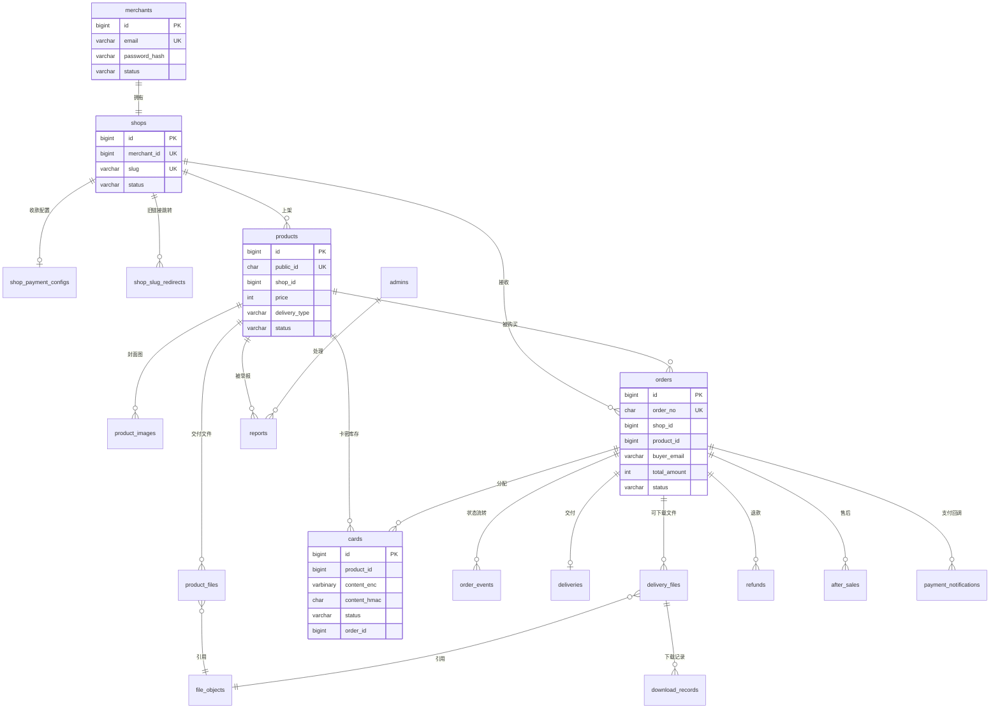

# MkClou 数据库设计

- 文档版本：v0.1
- 日期：2026-10-01
- 数据库：MySQL 8.4（InnoDB）+ Redis 7.4
- 依据：[PRD 需求文档](./prd/README.md) · [技术选型](./tech-stack.md)

> 本文档的 DDL 是表结构的唯一依据。开发时通过 golang-migrate 迁移脚本落地（`server/migrations/`），任何表结构修改都要同步更新本文档并登记变更记录。

---

## 1. 设计规范

### 1.1 命名
| 对象 | 规则 | 示例 |
|---|---|---|
| 表名 | 小写 + 下划线，复数 | `orders`、`product_files` |
| 字段 | 小写 + 下划线 | `buyer_email` |
| 主键 | `id` | — |
| 外键字段 | `关联表单数_id` | `shop_id` |
| 普通索引 | `idx_字段1_字段2` | `idx_shop_status_created` |
| 唯一索引 | `uk_字段` | `uk_order_no` |
| 时间字段 | `动作_at` | `paid_at` |
| 布尔字段 | `is_形容词` | `is_test` |

### 1.2 通用约定
| 约定 | 说明 |
|---|---|
| 字符集 | `utf8mb4` + `utf8mb4_0900_ai_ci`，支持 emoji 和生僻字 |
| 主键 | `BIGINT UNSIGNED AUTO_INCREMENT`，只在内部使用，**不对外暴露** |
| 对外 ID | 订单用 `order_no`，商品用 `public_id`，避免暴露业务量和被遍历 |
| 金额 | `INT UNSIGNED`，单位**分**。最大约 4294 万元，远超单笔上限 5 万元 |
| 时间 | `DATETIME(3)`，存 **UTC**，毫秒精度；由应用层写入，不依赖数据库时区 |
| 通用字段 | 每张表都有 `created_at`，可修改的表有 `updated_at` |
| 软删除 | 只有 `merchants`、`products` 使用 `deleted_at`；其余表要么不删除，要么按保留期物理清理 |
| 状态 | `VARCHAR(20)` 存英文枚举（如 `PENDING`），可读性好，代码中用常量定义 |
| 外键约束 | **不建物理外键**，由应用层保证引用完整性（理由见 7.5） |
| 邮箱 | 统一转为小写后存储 |
| JSON | 只存“整体读写、不参与查询条件”的数据，如快照、配置 |

### 1.3 多租户隔离
所有商家业务表都带 `shop_id` 字段，并作为索引的第一列。repository 层的查询方法强制要求传入 `shop_id`，从机制上防止越权（见 PRD SEC-05）。

---

## 2. ER 图



**表清单（共 25 张）**

| 领域 | 表 | 说明 |
|---|---|---|
| 账号 | `merchants`、`admins` | 商家、平台管理员 |
| 店铺 | `shops`、`shop_slug_redirects`、`shop_payment_configs` | 店铺、旧链接跳转、收款配置 |
| 商品 | `products`、`product_images`、`product_files`、`file_objects`、`cards` | 商品、封面、交付文件、文件对象、卡密 |
| 订单 | `orders`、`order_events`、`payment_notifications`、`refunds` | 订单、状态流水、支付回调、退款 |
| 交付 | `deliveries`、`delivery_files`、`download_records` | 交付快照、可下载文件、下载记录 |
| 售后 | `after_sales` | 售后单 |
| 平台 | `reports`、`sensitive_words`、`system_configs` | 举报、敏感词、系统配置 |
| 通知 | `email_logs` | 邮件发送记录 |
| 统计 | `analytics_events`、`analytics_daily` | 埋点事件、每日汇总 |
| 审计 | `audit_logs` | 审计日志 |

---

## 3. 表结构

### 3.1 账号

#### merchants 商家
```sql
CREATE TABLE merchants (
  id                BIGINT UNSIGNED NOT NULL AUTO_INCREMENT,
  email             VARCHAR(254)    NOT NULL COMMENT '登录邮箱，小写',
  password_hash     VARCHAR(100)    NOT NULL COMMENT 'bcrypt 哈希',
  nickname          VARCHAR(40)     NOT NULL DEFAULT '',
  email_verified_at DATETIME(3)     NULL     COMMENT 'NULL 表示未验证',
  status            VARCHAR(20)     NOT NULL DEFAULT 'ACTIVE' COMMENT 'ACTIVE / BANNED',
  ban_reason        VARCHAR(500)    NULL,
  settings          JSON            NULL     COMMENT '通知开关等个人设置',
  last_login_at     DATETIME(3)     NULL,
  created_at        DATETIME(3)     NOT NULL,
  updated_at        DATETIME(3)     NOT NULL,
  deleted_at        DATETIME(3)     NULL,
  PRIMARY KEY (id),
  UNIQUE KEY uk_email (email)
) ENGINE=InnoDB DEFAULT CHARSET=utf8mb4 COLLATE=utf8mb4_0900_ai_ci COMMENT='商家';
```
- `settings` 示例：`{"notify":{"newOrder":true,"lowStock":true}}`
- 登录失败计数、锁定状态、会话、邮箱验证令牌放在 Redis（见第 4 节），因为它们是短期、高频、带过期时间的数据。

#### admins 平台管理员
```sql
CREATE TABLE admins (
  id              BIGINT UNSIGNED NOT NULL AUTO_INCREMENT,
  email           VARCHAR(254)    NOT NULL,
  password_hash   VARCHAR(100)    NOT NULL,
  totp_secret_enc VARBINARY(256)  NULL     COMMENT 'TOTP 密钥，AES-GCM 加密；NULL 表示未绑定',
  status          VARCHAR(20)     NOT NULL DEFAULT 'ACTIVE',
  last_login_at   DATETIME(3)     NULL,
  created_at      DATETIME(3)     NOT NULL,
  updated_at      DATETIME(3)     NOT NULL,
  PRIMARY KEY (id),
  UNIQUE KEY uk_email (email)
) ENGINE=InnoDB DEFAULT CHARSET=utf8mb4 COLLATE=utf8mb4_0900_ai_ci COMMENT='平台管理员';
```

### 3.2 店铺

#### shops 店铺
```sql
CREATE TABLE shops (
  id              BIGINT UNSIGNED NOT NULL AUTO_INCREMENT,
  merchant_id     BIGINT UNSIGNED NOT NULL,
  slug            VARCHAR(20)     NOT NULL COMMENT '店铺链接标识',
  name            VARCHAR(40)     NOT NULL,
  description     VARCHAR(400)    NOT NULL DEFAULT '',
  avatar_key      VARCHAR(255)    NULL     COMMENT '对象存储 key',
  cover_key       VARCHAR(255)    NULL,
  contact_email   VARCHAR(254)    NOT NULL,
  social_links    JSON            NULL     COMMENT '[{"type":"github","url":"…"}]',
  theme           JSON            NOT NULL COMMENT '主题色、卡片比例、布局、明暗模式',
  status          VARCHAR(20)     NOT NULL DEFAULT 'OPEN' COMMENT 'OPEN / PAUSED / BANNED',
  pause_note      VARCHAR(200)    NULL,
  slug_changed_at DATETIME(3)     NULL     COMMENT '用于限制 30 天改一次',
  created_at      DATETIME(3)     NOT NULL,
  updated_at      DATETIME(3)     NOT NULL,
  PRIMARY KEY (id),
  UNIQUE KEY uk_merchant (merchant_id) COMMENT 'V1.0 一个商家一个店铺',
  UNIQUE KEY uk_slug (slug)
) ENGINE=InnoDB DEFAULT CHARSET=utf8mb4 COLLATE=utf8mb4_0900_ai_ci COMMENT='店铺';
```
- `theme` 示例：`{"color":"#5B5BD6","cardRatio":"4:3","layout":"grid","mode":"light"}`
- V2 支持多店铺时，去掉 `uk_merchant` 唯一约束即可，其他结构不变。

#### shop_slug_redirects 店铺旧链接跳转
```sql
CREATE TABLE shop_slug_redirects (
  old_slug   VARCHAR(20)     NOT NULL,
  shop_id    BIGINT UNSIGNED NOT NULL,
  expires_at DATETIME(3)     NOT NULL COMMENT '修改后 90 天',
  created_at DATETIME(3)     NOT NULL,
  PRIMARY KEY (old_slug)
) ENGINE=InnoDB DEFAULT CHARSET=utf8mb4 COLLATE=utf8mb4_0900_ai_ci COMMENT='店铺旧链接 301 跳转';
```
- 新店铺占用某个 slug 时，需同时检查 `shops.slug` 和未过期的 `shop_slug_redirects.old_slug`。

#### shop_payment_configs 收款配置
```sql
CREATE TABLE shop_payment_configs (
  id                BIGINT UNSIGNED NOT NULL AUTO_INCREMENT,
  shop_id           BIGINT UNSIGNED NOT NULL,
  provider          VARCHAR(20)     NOT NULL DEFAULT 'ALIPAY',
  env               VARCHAR(20)     NOT NULL COMMENT 'SANDBOX / PRODUCTION',
  app_id            VARCHAR(32)     NOT NULL,
  private_key_enc   VARBINARY(4096) NOT NULL COMMENT '应用私钥，AES-256-GCM 加密',
  private_key_tail  CHAR(6)         NOT NULL COMMENT '私钥末尾 6 位，用于页面识别',
  platform_pub_key  TEXT            NOT NULL COMMENT '支付宝公钥',
  key_version       SMALLINT        NOT NULL DEFAULT 1 COMMENT '加密主密钥版本，支持密钥轮换',
  status            VARCHAR(20)     NOT NULL COMMENT 'ACTIVE / INVALID',
  verified_at       DATETIME(3)     NULL,
  last_error        VARCHAR(500)    NULL,
  created_at        DATETIME(3)     NOT NULL,
  updated_at        DATETIME(3)     NOT NULL,
  PRIMARY KEY (id),
  UNIQUE KEY uk_shop_provider (shop_id, provider)
) ENGINE=InnoDB DEFAULT CHARSET=utf8mb4 COLLATE=utf8mb4_0900_ai_ci COMMENT='店铺收款配置';
```
- 单独建表而不是放在 `shops` 中：敏感数据**隔离存放**，普通的店铺查询不会读到私钥；V2 接入微信支付时只需新增一行 `provider = 'WECHAT'`。

### 3.3 商品

#### products 商品
```sql
CREATE TABLE products (
  id                  BIGINT UNSIGNED  NOT NULL AUTO_INCREMENT,
  public_id           CHAR(14)         NOT NULL COMMENT '对外 ID，如 p_7Hk2Qa9xLm3c',
  shop_id             BIGINT UNSIGNED  NOT NULL,
  name                VARCHAR(120)     NOT NULL,
  tagline             VARCHAR(160)     NOT NULL DEFAULT '' COMMENT '一句话卖点',
  price               INT UNSIGNED     NOT NULL COMMENT '分；0 表示免费',
  original_price      INT UNSIGNED     NULL     COMMENT '划线价，分',
  delivery_type       VARCHAR(20)      NOT NULL COMMENT 'FILE / LINK / TEXT / CARD',
  status              VARCHAR(20)      NOT NULL DEFAULT 'DRAFT'
                      COMMENT 'DRAFT / PENDING_REVIEW / ON_SALE / OFF_SALE / BANNED',
  description_md      TEXT             NULL     COMMENT '商品介绍 Markdown',
  detail              JSON             NULL     COMMENT '包含内容、适合谁、常见问题、购买须知',
  delivery_config     JSON             NULL     COMMENT '链接列表、文本内容、卡密说明、交付附言',
  max_per_order       TINYINT UNSIGNED NOT NULL DEFAULT 1  COMMENT '单次限购（卡密）',
  download_limit      TINYINT UNSIGNED NULL     DEFAULT 5  COMMENT '每文件下载次数；NULL 不限',
  low_stock_threshold SMALLINT UNSIGNED NOT NULL DEFAULT 5,
  stock_available     INT UNSIGNED     NOT NULL DEFAULT 0  COMMENT '卡密可售数量（冗余计数）',
  sales_count         INT UNSIGNED     NOT NULL DEFAULT 0  COMMENT '累计销量（冗余计数）',
  sort_order          INT              NOT NULL DEFAULT 0,
  ban_reason          VARCHAR(500)     NULL,
  version             INT UNSIGNED     NOT NULL DEFAULT 1  COMMENT '乐观锁',
  published_at        DATETIME(3)      NULL,
  created_at          DATETIME(3)      NOT NULL,
  updated_at          DATETIME(3)      NOT NULL,
  deleted_at          DATETIME(3)      NULL,
  PRIMARY KEY (id),
  UNIQUE KEY uk_public_id (public_id),
  KEY idx_shop_status_sort (shop_id, status, sort_order)
) ENGINE=InnoDB DEFAULT CHARSET=utf8mb4 COLLATE=utf8mb4_0900_ai_ci COMMENT='商品';
```
- `name VARCHAR(120)`：PRD 限制 60 字符，这里留出余量，长度由应用层校验。
- `detail` 示例：
  ```json
  {"includes":["3 套 Figma 模板"],"audience":"…","faqs":[{"q":"…","a":"…"}],"notice":"…"}
  ```
- `delivery_config` 示例（按类型）：
  ```json
  {"links":[{"name":"百度网盘","url":"https://…","code":"ab12"}],"note":"感谢购买"}
  {"text":"## 使用说明 …","note":"…"}
  {"cardInstructions":"在 App 设置页兑换","note":"…"}
  ```
- **冗余计数** `stock_available`、`sales_count`：列表页需要展示，如果每次都 `COUNT(*)` 卡密表会很慢。它们在卡密导入、预占、释放、售出的**同一个事务**中更新，保证一致；另有每日校准任务兜底。
- **乐观锁** `version`：编辑保存时 `UPDATE … WHERE id=? AND version=?`，影响行数为 0 说明已被其他页面修改（PRD 03 第 5 节）。

#### product_images 商品封面图
```sql
CREATE TABLE product_images (
  id         BIGINT UNSIGNED  NOT NULL AUTO_INCREMENT,
  product_id BIGINT UNSIGNED  NOT NULL,
  object_key VARCHAR(255)     NOT NULL COMMENT '公有桶 key',
  width      SMALLINT UNSIGNED NOT NULL,
  height     SMALLINT UNSIGNED NOT NULL,
  sort_order TINYINT UNSIGNED NOT NULL DEFAULT 0 COMMENT '0 为主图',
  created_at DATETIME(3)      NOT NULL,
  PRIMARY KEY (id),
  KEY idx_product_sort (product_id, sort_order)
) ENGINE=InnoDB DEFAULT CHARSET=utf8mb4 COLLATE=utf8mb4_0900_ai_ci COMMENT='商品封面图';
```

#### file_objects 文件对象
```sql
CREATE TABLE file_objects (
  id            BIGINT UNSIGNED NOT NULL AUTO_INCREMENT,
  shop_id       BIGINT UNSIGNED NOT NULL COMMENT '上传者店铺',
  bucket        VARCHAR(63)     NOT NULL COMMENT '私有桶',
  object_key    VARCHAR(255)    NOT NULL COMMENT '随机路径，不含原文件名',
  original_name VARCHAR(255)    NOT NULL,
  size          BIGINT UNSIGNED NOT NULL COMMENT '字节',
  mime_type     VARCHAR(127)    NOT NULL,
  sha256        CHAR(64)        NULL     COMMENT '上传完成后计算',
  status        VARCHAR(20)     NOT NULL COMMENT 'UPLOADING / READY / DELETED',
  upload_id     VARCHAR(255)    NULL     COMMENT '分片上传 ID，用于断点续传',
  created_at    DATETIME(3)     NOT NULL,
  updated_at    DATETIME(3)     NOT NULL,
  PRIMARY KEY (id),
  UNIQUE KEY uk_bucket_key (bucket, object_key),
  KEY idx_shop_status (shop_id, status)
) ENGINE=InnoDB DEFAULT CHARSET=utf8mb4 COLLATE=utf8mb4_0900_ai_ci COMMENT='私有文件对象';
```

#### product_files 商品交付文件
```sql
CREATE TABLE product_files (
  id             BIGINT UNSIGNED  NOT NULL AUTO_INCREMENT,
  product_id     BIGINT UNSIGNED  NOT NULL,
  file_object_id BIGINT UNSIGNED  NOT NULL,
  display_name   VARCHAR(255)     NOT NULL COMMENT '展示给买家的文件名',
  sort_order     TINYINT UNSIGNED NOT NULL DEFAULT 0,
  created_at     DATETIME(3)      NOT NULL,
  PRIMARY KEY (id),
  KEY idx_product_sort (product_id, sort_order)
) ENGINE=InnoDB DEFAULT CHARSET=utf8mb4 COLLATE=utf8mb4_0900_ai_ci COMMENT='商品交付文件';
```
- **为什么把 `file_objects` 和 `product_files` 分开**：同一个物理文件可能同时被商品和多个历史订单引用。商家从商品中移除文件，只删除 `product_files` 的记录，`file_objects` 仍被 `delivery_files` 引用，老买家照样能下载。清理任务只删除**没有任何引用**且满足保留期的对象。

#### cards 卡密
```sql
CREATE TABLE cards (
  id           BIGINT UNSIGNED NOT NULL AUTO_INCREMENT,
  shop_id      BIGINT UNSIGNED NOT NULL,
  product_id   BIGINT UNSIGNED NOT NULL,
  content_enc  VARBINARY(1024) NOT NULL COMMENT '卡密内容，AES-256-GCM 加密',
  content_hmac CHAR(64)        NOT NULL COMMENT 'HMAC-SHA256(卡密)，用于去重',
  masked       VARCHAR(32)     NOT NULL COMMENT '脱敏展示，如 ABCD****WXYZ',
  status       VARCHAR(20)     NOT NULL DEFAULT 'AVAILABLE' COMMENT 'AVAILABLE / RESERVED / SOLD',
  order_id     BIGINT UNSIGNED NULL,
  batch_no     VARCHAR(32)     NOT NULL COMMENT '导入批次号',
  reserved_at  DATETIME(3)     NULL,
  sold_at      DATETIME(3)     NULL,
  created_at   DATETIME(3)     NOT NULL,
  updated_at   DATETIME(3)     NOT NULL,
  PRIMARY KEY (id),
  UNIQUE KEY uk_product_hmac (product_id, content_hmac),
  KEY idx_product_status (product_id, status, id),
  KEY idx_order (order_id)
) ENGINE=InnoDB DEFAULT CHARSET=utf8mb4 COLLATE=utf8mb4_0900_ai_ci COMMENT='卡密';
```
- **加密后怎么去重**：AES-GCM 每次加密结果都不同，无法直接比较密文。因此额外存一份 `HMAC-SHA256(密钥, 卡密)`：同一卡密的 HMAC 值相同，可以用唯一索引去重；没有密钥则无法反推或撞库，比普通 SHA-256 更安全。
- **预占查询依赖的索引** `idx_product_status (product_id, status, id)`：
  ```sql
  SELECT id FROM cards
  WHERE product_id = ? AND status = 'AVAILABLE'
  ORDER BY id LIMIT ?
  FOR UPDATE SKIP LOCKED;
  ```
  索引完全覆盖 WHERE 和 ORDER BY，InnoDB 只锁定扫描到的少量行；`SKIP LOCKED` 让并发下单的事务跳过已被锁定的卡密，互不等待。

### 3.4 订单

#### orders 订单
```sql
CREATE TABLE orders (
  id                BIGINT UNSIGNED  NOT NULL AUTO_INCREMENT,
  order_no          CHAR(20)         NOT NULL COMMENT 'MK + yyyyMMdd + 10 位',
  shop_id           BIGINT UNSIGNED  NOT NULL,
  product_id        BIGINT UNSIGNED  NOT NULL,
  buyer_email       VARCHAR(254)     NOT NULL,
  quantity          TINYINT UNSIGNED NOT NULL DEFAULT 1,
  unit_price        INT UNSIGNED     NOT NULL COMMENT '下单时单价，分',
  total_amount      INT UNSIGNED     NOT NULL COMMENT '应付总额，分',
  status            VARCHAR(20)      NOT NULL
                    COMMENT 'PENDING / PAID / DELIVERED / DELIVERY_FAILED / CLOSED / REFUNDING / REFUNDED',
  is_test           TINYINT(1)       NOT NULL DEFAULT 0 COMMENT '沙箱订单',
  product_snapshot  JSON             NOT NULL COMMENT '下单时商品名称、封面、价格、交付类型',
  access_token_hash CHAR(64)         NOT NULL COMMENT '交付页令牌的 SHA-256',
  idempotency_key   CHAR(36)         NOT NULL COMMENT '前端生成的 UUID',
  pay_channel       VARCHAR(20)      NULL     COMMENT 'ALIPAY_PAGE / ALIPAY_WAP / FREE',
  trade_no          VARCHAR(64)      NULL     COMMENT '支付宝交易号',
  paid_amount       INT UNSIGNED     NULL     COMMENT '实际到账金额（回调）',
  expires_at        DATETIME(3)      NOT NULL COMMENT '支付截止时间',
  paid_at           DATETIME(3)      NULL,
  delivered_at      DATETIME(3)      NULL,
  closed_at         DATETIME(3)      NULL,
  refunded_at       DATETIME(3)      NULL,
  close_reason      VARCHAR(20)      NULL     COMMENT 'TIMEOUT / BUYER_CANCEL',
  buyer_ip          VARBINARY(16)    NULL     COMMENT 'INET6_ATON，兼容 IPv4/IPv6',
  source            JSON             NULL     COMMENT '来源渠道、UTM 参数',
  version           INT UNSIGNED     NOT NULL DEFAULT 1,
  created_at        DATETIME(3)      NOT NULL,
  updated_at        DATETIME(3)      NOT NULL,
  PRIMARY KEY (id),
  UNIQUE KEY uk_order_no (order_no),
  UNIQUE KEY uk_idempotency (idempotency_key),
  UNIQUE KEY uk_trade_no (trade_no),
  KEY idx_shop_created (shop_id, created_at),
  KEY idx_shop_status_created (shop_id, status, created_at),
  KEY idx_buyer_email_created (buyer_email, created_at),
  KEY idx_status_created (status, created_at)
) ENGINE=InnoDB DEFAULT CHARSET=utf8mb4 COLLATE=utf8mb4_0900_ai_ci COMMENT='订单';
```

**索引对应的查询**
| 索引 | 服务的查询 |
|---|---|
| `uk_order_no` | 交付页、回调按订单号定位 |
| `uk_idempotency` | 重复提交返回同一订单（数据库层兜底） |
| `uk_trade_no` | 防止同一笔支付宝交易被关联到两个订单（MySQL 唯一索引允许多个 NULL） |
| `idx_shop_created` | 商家订单列表“全部”Tab、统计 |
| `idx_shop_status_created` | 商家订单列表按状态筛选 |
| `idx_buyer_email_created` | 买家已购查询 |
| `idx_status_created` | 补偿任务：扫描超时未关闭的 PENDING 订单、REFUNDING 订单 |

**为什么存 `product_snapshot`**：商品名称、价格之后可能修改，甚至商品被删除。订单必须保留**交易发生时**的信息，否则订单列表会显示错误的名称和价格，也会产生纠纷。

**状态更新的写法**（全部使用条件更新）
```sql
UPDATE orders
SET status = 'PAID', trade_no = ?, paid_amount = ?, paid_at = ?, version = version + 1, updated_at = ?
WHERE order_no = ? AND status = 'PENDING';
-- 影响行数 = 0 → 已被其他流程处理，读取最新状态后幂等返回
```

#### order_events 订单状态流水
```sql
CREATE TABLE order_events (
  id          BIGINT UNSIGNED NOT NULL AUTO_INCREMENT,
  order_id    BIGINT UNSIGNED NOT NULL,
  event       VARCHAR(40)     NOT NULL COMMENT 'CREATED / PAID / DELIVERED / EMAIL_SENT / CLOSED / REFUND_REQUESTED …',
  from_status VARCHAR(20)     NULL,
  to_status   VARCHAR(20)     NULL,
  actor_type  VARCHAR(20)     NOT NULL COMMENT 'SYSTEM / BUYER / MERCHANT / ADMIN / ALIPAY',
  actor_id    BIGINT UNSIGNED NULL,
  detail      JSON            NULL,
  created_at  DATETIME(3)     NOT NULL,
  PRIMARY KEY (id),
  KEY idx_order_created (order_id, created_at)
) ENGINE=InnoDB DEFAULT CHARSET=utf8mb4 COLLATE=utf8mb4_0900_ai_ci COMMENT='订单事件流水';
```
- 与状态变更在**同一事务**中写入；只追加，不修改。用于订单详情时间线和问题排查。

#### payment_notifications 支付回调记录
```sql
CREATE TABLE payment_notifications (
  id             BIGINT UNSIGNED NOT NULL AUTO_INCREMENT,
  shop_id        BIGINT UNSIGNED NOT NULL,
  provider       VARCHAR(20)     NOT NULL,
  kind           VARCHAR(20)     NOT NULL COMMENT 'NOTIFY / QUERY / REFUND',
  order_no       CHAR(20)        NULL,
  raw_body       MEDIUMTEXT      NOT NULL COMMENT '原始报文',
  verify_result  VARCHAR(20)     NOT NULL COMMENT 'OK / BAD_SIGN / MISMATCH',
  process_result VARCHAR(40)     NOT NULL COMMENT 'PROCESSED / DUPLICATE / IGNORED / ERROR',
  remote_ip      VARBINARY(16)   NULL,
  created_at     DATETIME(3)     NOT NULL,
  PRIMARY KEY (id),
  KEY idx_order_no (order_no),
  KEY idx_created (created_at)
) ENGINE=InnoDB DEFAULT CHARSET=utf8mb4 COLLATE=utf8mb4_0900_ai_ci COMMENT='支付回调与查询原始记录，保留 180 天';
```

#### refunds 退款
```sql
CREATE TABLE refunds (
  id                BIGINT UNSIGNED NOT NULL AUTO_INCREMENT,
  order_id          BIGINT UNSIGNED NOT NULL,
  shop_id           BIGINT UNSIGNED NOT NULL,
  out_request_no    VARCHAR(64)     NOT NULL COMMENT '退款请求号，支付宝侧幂等',
  amount            INT UNSIGNED    NOT NULL,
  reason            VARCHAR(200)    NOT NULL,
  card_action       VARCHAR(20)     NULL     COMMENT 'KEEP_SOLD / RETURN_STOCK',
  status            VARCHAR(20)     NOT NULL COMMENT 'PROCESSING / SUCCESS / FAILED',
  fail_reason       VARCHAR(500)    NULL,
  operator_type     VARCHAR(20)     NOT NULL COMMENT 'MERCHANT / SYSTEM',
  operator_id       BIGINT UNSIGNED NULL,
  after_sale_id     BIGINT UNSIGNED NULL COMMENT '由售后单发起时关联',
  created_at        DATETIME(3)     NOT NULL,
  finished_at       DATETIME(3)     NULL,
  updated_at        DATETIME(3)     NOT NULL,
  PRIMARY KEY (id),
  UNIQUE KEY uk_out_request_no (out_request_no),
  KEY idx_order (order_id),
  KEY idx_status_created (status, created_at)
) ENGINE=InnoDB DEFAULT CHARSET=utf8mb4 COLLATE=utf8mb4_0900_ai_ci COMMENT='退款';
```
- 独立建表而不是在 `orders` 上加字段：V2 支持部分退款后，一个订单可能有多条退款记录。
- `operator_type = SYSTEM`：关单后到账、库存不足时的自动退款（PRD 04 第 5.3 节）。

### 3.5 交付

#### deliveries 交付快照
```sql
CREATE TABLE deliveries (
  id            BIGINT UNSIGNED NOT NULL AUTO_INCREMENT,
  order_id      BIGINT UNSIGNED NOT NULL,
  delivery_type VARCHAR(20)     NOT NULL,
  snapshot      JSON            NOT NULL COMMENT '链接、文本、卡密说明、交付附言（交付时的内容）',
  revoked_at    DATETIME(3)     NULL     COMMENT '退款后撤销访问',
  created_at    DATETIME(3)     NOT NULL,
  PRIMARY KEY (id),
  UNIQUE KEY uk_order (order_id)
) ENGINE=InnoDB DEFAULT CHARSET=utf8mb4 COLLATE=utf8mb4_0900_ai_ci COMMENT='交付快照';
```
- `uk_order` 唯一约束是**交付幂等的最后一道防线**：即使交付任务因为异常被执行了两次，第二次插入会失败，不会重复交付。
- 卡密内容不重复写入快照，通过 `cards.order_id` 查询（避免明文卡密出现在两个地方）。

#### delivery_files 订单可下载文件
```sql
CREATE TABLE delivery_files (
  id             BIGINT UNSIGNED  NOT NULL AUTO_INCREMENT,
  order_id       BIGINT UNSIGNED  NOT NULL,
  file_object_id BIGINT UNSIGNED  NOT NULL,
  display_name   VARCHAR(255)     NOT NULL,
  size           BIGINT UNSIGNED  NOT NULL,
  download_count SMALLINT UNSIGNED NOT NULL DEFAULT 0,
  download_limit SMALLINT UNSIGNED NULL     COMMENT 'NULL 不限',
  sort_order     TINYINT UNSIGNED NOT NULL DEFAULT 0,
  created_at     DATETIME(3)      NOT NULL,
  updated_at     DATETIME(3)      NOT NULL,
  PRIMARY KEY (id),
  KEY idx_order (order_id),
  KEY idx_file_object (file_object_id)
) ENGINE=InnoDB DEFAULT CHARSET=utf8mb4 COLLATE=utf8mb4_0900_ai_ci COMMENT='订单可下载文件';
```
**下载次数的原子扣减**
```sql
UPDATE delivery_files
SET download_count = download_count + 1, updated_at = ?
WHERE id = ? AND order_id = ?
  AND (download_limit IS NULL OR download_count < download_limit);
-- 影响行数 = 0 → 次数已用完
```
- 选择 MySQL 条件更新而不是 Redis `INCR`：下载次数是**需要长期保存的业务数据**，放在 Redis 中一旦丢失就会被重置；而下载频率很低，MySQL 完全承受得住。Redis 只用于“30 秒内同一 IP 重复下载不计数”的短期去重标记。（PRD DLV-04 已同步修改）

#### download_records 下载记录
```sql
CREATE TABLE download_records (
  id               BIGINT UNSIGNED NOT NULL AUTO_INCREMENT,
  delivery_file_id BIGINT UNSIGNED NOT NULL,
  order_id         BIGINT UNSIGNED NOT NULL,
  ip               VARBINARY(16)   NULL,
  user_agent       VARCHAR(255)    NULL,
  counted          TINYINT(1)      NOT NULL COMMENT '是否计入次数',
  created_at       DATETIME(3)     NOT NULL,
  PRIMARY KEY (id),
  KEY idx_order_created (order_id, created_at)
) ENGINE=InnoDB DEFAULT CHARSET=utf8mb4 COLLATE=utf8mb4_0900_ai_ci COMMENT='下载记录';
```

### 3.6 售后

#### after_sales 售后单
```sql
CREATE TABLE after_sales (
  id             BIGINT UNSIGNED NOT NULL AUTO_INCREMENT,
  ticket_no      CHAR(20)        NOT NULL COMMENT 'AS + yyyyMMdd + 10 位',
  order_id       BIGINT UNSIGNED NOT NULL,
  shop_id        BIGINT UNSIGNED NOT NULL,
  type           VARCHAR(30)     NOT NULL COMMENT 'CANNOT_DOWNLOAD / INVALID_CARD / NOT_AS_DESCRIBED / DUPLICATE / OTHER',
  description    VARCHAR(1000)   NOT NULL,
  image_keys     JSON            NULL     COMMENT '截图，最多 3 张',
  buyer_email    VARCHAR(254)    NOT NULL,
  status         VARCHAR(20)     NOT NULL COMMENT 'OPEN / RESENT / REFUNDED / REJECTED / CLOSED',
  merchant_reply VARCHAR(1000)   NULL,
  reminded_at    DATETIME(3)     NULL     COMMENT '48 小时未处理提醒时间',
  handled_at     DATETIME(3)     NULL,
  created_at     DATETIME(3)     NOT NULL,
  updated_at     DATETIME(3)     NOT NULL,
  PRIMARY KEY (id),
  UNIQUE KEY uk_ticket_no (ticket_no),
  KEY idx_shop_status_created (shop_id, status, created_at),
  KEY idx_order (order_id)
) ENGINE=InnoDB DEFAULT CHARSET=utf8mb4 COLLATE=utf8mb4_0900_ai_ci COMMENT='售后单';
```
- “每个订单同时只能有 1 个处理中的售后单”在应用层校验（查询 `order_id` + `status = OPEN`），并用订单维度的分布式锁防止并发提交。

### 3.7 平台

#### reports 举报
```sql
CREATE TABLE reports (
  id             BIGINT UNSIGNED NOT NULL AUTO_INCREMENT,
  product_id     BIGINT UNSIGNED NOT NULL,
  shop_id        BIGINT UNSIGNED NOT NULL,
  type           VARCHAR(30)     NOT NULL COMMENT 'ILLEGAL / PIRACY / FRAUD / NOT_AS_DESCRIBED / OTHER',
  description    VARCHAR(1000)   NOT NULL DEFAULT '',
  reporter_email VARCHAR(254)    NULL,
  reporter_ip    VARBINARY(16)   NOT NULL,
  status         VARCHAR(20)     NOT NULL DEFAULT 'PENDING' COMMENT 'PENDING / CONFIRMED / DISMISSED',
  handled_by     BIGINT UNSIGNED NULL     COMMENT 'admins.id',
  result_note    VARCHAR(500)    NULL,
  handled_at     DATETIME(3)     NULL,
  created_at     DATETIME(3)     NOT NULL,
  PRIMARY KEY (id),
  KEY idx_status_created (status, created_at),
  KEY idx_product_created (product_id, created_at)
) ENGINE=InnoDB DEFAULT CHARSET=utf8mb4 COLLATE=utf8mb4_0900_ai_ci COMMENT='商品举报';
```
- 自动下架判断：`SELECT COUNT(DISTINCT reporter_ip) FROM reports WHERE product_id = ? AND created_at > NOW() - 24h`，命中 `idx_product_created`。

#### sensitive_words 敏感词
```sql
CREATE TABLE sensitive_words (
  id         BIGINT UNSIGNED NOT NULL AUTO_INCREMENT,
  word       VARCHAR(100)    NOT NULL,
  level      VARCHAR(20)     NOT NULL COMMENT 'BLOCK / REVIEW',
  created_by BIGINT UNSIGNED NOT NULL,
  created_at DATETIME(3)     NOT NULL,
  PRIMARY KEY (id),
  UNIQUE KEY uk_word (word)
) ENGINE=InnoDB DEFAULT CHARSET=utf8mb4 COLLATE=utf8mb4_0900_ai_ci COMMENT='敏感词';
```
- 应用启动时加载到内存，构建 **AC 自动机**（Aho-Corasick）进行多模式匹配；修改后通过 Redis 发布订阅通知各实例重建（PRD 要求 1 分钟内生效）。

#### system_configs 系统配置
```sql
CREATE TABLE system_configs (
  config_key VARCHAR(64)     NOT NULL,
  value      JSON            NOT NULL,
  updated_by BIGINT UNSIGNED NULL,
  updated_at DATETIME(3)     NOT NULL,
  PRIMARY KEY (config_key)
) ENGINE=InnoDB DEFAULT CHARSET=utf8mb4 COLLATE=utf8mb4_0900_ai_ci COMMENT='系统配置';
```
- 示例 key：`reserved_slugs`、`upload_limits`、`rate_limits`、`maintenance`。

### 3.8 通知

#### email_logs 邮件发送记录
```sql
CREATE TABLE email_logs (
  id          BIGINT UNSIGNED  NOT NULL AUTO_INCREMENT,
  template    VARCHAR(40)      NOT NULL COMMENT 'DELIVERY / NEW_ORDER / VERIFY_EMAIL …',
  to_email    VARCHAR(254)     NOT NULL,
  subject     VARCHAR(200)     NOT NULL,
  shop_id     BIGINT UNSIGNED  NULL,
  order_id    BIGINT UNSIGNED  NULL,
  status      VARCHAR(20)      NOT NULL COMMENT 'PENDING / SENT / FAILED',
  attempts    TINYINT UNSIGNED NOT NULL DEFAULT 0,
  last_error  VARCHAR(500)     NULL,
  sent_at     DATETIME(3)      NULL,
  created_at  DATETIME(3)      NOT NULL,
  updated_at  DATETIME(3)      NOT NULL,
  PRIMARY KEY (id),
  KEY idx_order (order_id),
  KEY idx_created (created_at)
) ENGINE=InnoDB DEFAULT CHARSET=utf8mb4 COLLATE=utf8mb4_0900_ai_ci COMMENT='邮件发送记录，保留 90 天';
```
- 不存邮件正文：正文中可能包含卡密等敏感内容。重发时根据模板和订单重新渲染。

### 3.9 统计

#### analytics_events 埋点事件
```sql
CREATE TABLE analytics_events (
  id          BIGINT UNSIGNED NOT NULL AUTO_INCREMENT,
  event       VARCHAR(30)     NOT NULL COMMENT 'shop_view / product_view / checkout_start / order_create / order_paid',
  shop_id     BIGINT UNSIGNED NOT NULL,
  product_id  BIGINT UNSIGNED NULL,
  visitor_id  CHAR(22)        NOT NULL COMMENT '匿名访客 ID',
  source      VARCHAR(20)     NOT NULL COMMENT 'WECHAT / XHS / BILIBILI / SEARCH / DIRECT / OTHER',
  utm         JSON            NULL,
  created_at  DATETIME(3)     NOT NULL,
  PRIMARY KEY (id),
  KEY idx_created (created_at)
) ENGINE=InnoDB DEFAULT CHARSET=utf8mb4 COLLATE=utf8mb4_0900_ai_ci COMMENT='埋点原始事件，保留 90 天';
```
- 写入路径：前端上报 → API 推入 Redis 队列 → worker **批量**写入（每 5 秒或满 500 条），避免高频单条插入。

#### analytics_daily 每日统计
```sql
CREATE TABLE analytics_daily (
  stat_date      DATE            NOT NULL COMMENT '北京时间自然日',
  shop_id        BIGINT UNSIGNED NOT NULL,
  product_id     BIGINT UNSIGNED NOT NULL DEFAULT 0 COMMENT '0 表示店铺汇总',
  source         VARCHAR(20)     NOT NULL DEFAULT 'ALL',
  pv             INT UNSIGNED    NOT NULL DEFAULT 0,
  uv             INT UNSIGNED    NOT NULL DEFAULT 0,
  checkout_uv    INT UNSIGNED    NOT NULL DEFAULT 0,
  orders_created INT UNSIGNED    NOT NULL DEFAULT 0,
  orders_paid    INT UNSIGNED    NOT NULL DEFAULT 0,
  revenue        INT UNSIGNED    NOT NULL DEFAULT 0 COMMENT '分',
  refund_amount  INT UNSIGNED    NOT NULL DEFAULT 0 COMMENT '分',
  updated_at     DATETIME(3)     NOT NULL,
  PRIMARY KEY (shop_id, stat_date, product_id, source)
) ENGINE=InnoDB DEFAULT CHARSET=utf8mb4 COLLATE=utf8mb4_0900_ai_ci COMMENT='每日统计汇总';
```
- 每小时增量汇总当天数据，凌晨对前一天全量重算（`INSERT … ON DUPLICATE KEY UPDATE`）。
- 当天的 UV 实时值使用 Redis HyperLogLog 计算（见第 4 节）。
- 主键以 `shop_id` 开头，商家查询“某店铺某时间段”的统计直接走主键范围扫描。

### 3.10 审计

#### audit_logs 审计日志
```sql
CREATE TABLE audit_logs (
  id          BIGINT UNSIGNED NOT NULL AUTO_INCREMENT,
  actor_type  VARCHAR(20)     NOT NULL COMMENT 'MERCHANT / ADMIN / SYSTEM',
  actor_id    BIGINT UNSIGNED NULL,
  shop_id     BIGINT UNSIGNED NULL,
  action      VARCHAR(50)     NOT NULL COMMENT 'LOGIN / REFUND / EXPORT_CARDS / VIEW_CARD / BAN_SHOP …',
  target_type VARCHAR(30)     NULL,
  target_id   VARCHAR(64)     NULL,
  ip          VARBINARY(16)   NULL,
  detail      JSON            NULL     COMMENT '变更前后摘要，不含敏感明文',
  created_at  DATETIME(3)     NOT NULL,
  PRIMARY KEY (id),
  KEY idx_shop_created (shop_id, created_at),
  KEY idx_actor_created (actor_type, actor_id, created_at)
) ENGINE=InnoDB DEFAULT CHARSET=utf8mb4 COLLATE=utf8mb4_0900_ai_ci COMMENT='审计日志，保留 1 年';
```
- 应用使用的数据库账号对该表**只有 INSERT 和 SELECT 权限**，从权限层面保证不可修改、不可删除。

---

## 4. Redis 设计

| Key | 类型 | TTL | 用途 |
|---|---|---|---|
| `mk:sess:{merchantId}:{sessionId}` | Hash | 7 / 30 天 | 会话信息：Refresh Token 哈希、设备、IP、最近活动 |
| `mk:sess:idx:{merchantId}` | Set | — | 该商家所有会话 ID，用于设备列表和“退出所有设备” |
| `mk:rt:used:{tokenHash}` | String | 30 天 | 已轮换的 Refresh Token 及轮换时间；超过 10 秒宽限期后再次出现即判定被盗，吊销该商家全部会话 |
| `mk:login:fail:{email}` | String | 15 分钟 | 登录失败计数 |
| `mk:login:lock:{email}` | String | 15 分钟 | 账号锁定标记 |
| `mk:email:verify:{tokenHash}` | String | 24 小时 | 邮箱验证令牌 → merchantId |
| `mk:pwd:reset:{tokenHash}` | String | 30 分钟 | 重置密码令牌 → merchantId |
| `mk:buyer:code:{email}` | Hash | 10 分钟 | 查单验证码哈希、剩余尝试次数 |
| `mk:buyer:sess:{sessionId}` | String | 2 小时 | 买家查单会话 → email |
| `mk:mail:cooldown:{type}:{email}` | String | 60 秒 | 邮件发送冷却 |
| `mk:mail:daily:{type}:{email}:{date}` | String | 1 天 | 每日发送次数 |
| `rate:mk:rl:{rule}:{dimension}` | String | 按规则 | 限流（GCRA 算法，`rate:` 前缀由 redis_rate 库自动添加） |
| `mk:captcha:{id}` | String | 5 分钟 | 图形验证码答案 |
| `mk:rt:{tokenHash}` | String | 7 / 30 天 | Refresh Token 哈希 → 所属会话（`商家ID:会话ID`） |
| `mk:lock:order:{orderNo}` | String | 10 秒 | 订单处理分布式锁（SET NX PX + 唯一值，Lua 脚本释放） |
| `mk:pay:query:{orderNo}` | String | 5 秒 | 主动查询频率限制 |
| `mk:dl:dedup:{deliveryFileId}:{ip}` | String | 30 秒 | 重复下载不计数 |
| `mk:shop:{slug}` | String（JSON） | 5 分钟 | 店铺页缓存 |
| `mk:product:{publicId}` | String（JSON） | 5 分钟 | 商品详情缓存 |
| `mk:dash:{shopId}:{range}` | String（JSON） | 5 分钟 | 后台概览指标缓存 |
| `mk:uv:{shopId}:{date}` | HyperLogLog | 2 天 | 当日店铺 UV（误差约 0.81%，每个 Key 仅 12KB） |
| `mk:events:queue` | List | — | 埋点事件缓冲队列 |
| `mk:sensitive:version` | Pub/Sub 频道 | — | 敏感词更新通知 |
| `asynq:*` | — | — | Asynq 任务队列（关单、交付、邮件等） |

**缓存一致性**：店铺和商品缓存采用 **Cache Aside**：读时未命中则查库并写缓存；修改时先更新数据库，再**删除**缓存。由于买家页使用 SSR 且 TTL 只有 5 分钟，极端情况下的短暂不一致可以接受。库存和价格**不走缓存**，下单时以数据库为准。

---

## 5. 关键场景的数据流转

### 5.1 一次卡密购买涉及的写操作
| 步骤 | 事务 | 写入 |
|---|---|---|
| 下单 | 事务 1 | `orders` 插入（PENDING）；`cards` 预占（AVAILABLE→RESERVED）；`products.stock_available -= n`；`order_events` 插入 |
| 支付回调 | 事务 2 | `payment_notifications` 插入；`orders` 条件更新（PENDING→PAID）；`order_events` 插入 |
| 交付 | 事务 3 | `cards` RESERVED→SOLD；`deliveries` 插入；`orders` PAID→DELIVERED；`products.sales_count += 1`；`order_events` 插入 |
| 通知 | 异步 | `email_logs` 插入并更新状态 |
| 超时关单（如未支付） | 事务 | `orders` PENDING→CLOSED；`cards` RESERVED→AVAILABLE；`products.stock_available += n`；`order_events` 插入 |

### 5.2 为什么支付和交付拆成两个事务
- 支付回调必须**尽快**返回 `success` 给支付宝，交付可能涉及更多操作和失败重试。
- 拆开后，交付失败不会导致“已收款”状态丢失：订单停在 `PAID`，由重试机制和 `DELIVERY_FAILED` 状态兜底。

---

## 6. 容量估算（上线第一年）

| 表 | 估算行数 | 说明 |
|---|---|---|
| `merchants` / `shops` | < 1,000 | — |
| `products` | < 10,000 | — |
| `cards` | < 500,000 | 卡密商家批量导入 |
| `orders` | < 100,000 | — |
| `order_events` | < 500,000 | 每单约 5 条 |
| `analytics_events` | < 10,000,000 | 保留 90 天，按天清理 |
| `audit_logs` | < 1,000,000 | — |

结论：单个 MySQL 实例完全够用，**无需分库分表**。`analytics_events` 是唯一的大表，按 `created_at` 批量删除过期数据（每次删除 5000 行，避免长事务）；数据量继续增长时可改为按月分区表，直接 `DROP PARTITION`。

---

## 7. 设计决策说明（面试要点）

### 7.1 金额为什么用整数分
浮点数无法精确表示 0.1，`0.1 + 0.2 ≠ 0.3`，累加后会产生误差。`DECIMAL` 可行，但整数分在 Go 中直接对应 `int64`，计算、比较、序列化都更简单，与支付宝接口的转换在边界处统一处理。

### 7.2 为什么对外使用 `order_no` / `public_id` 而不是自增 ID
自增 ID 会暴露业务量（今天第 1000 单），并且可以被遍历（改 URL 中的 ID 访问别人的订单）。

### 7.3 卡密为什么单独建表，而不是存成商品的 JSON 数组
- 每张卡密需要独立的状态、订单关联和行级锁，JSON 数组无法实现并发安全的预占。
- 单个商品可能有数千张卡密，单行 JSON 会非常大，每次修改都要整体重写。

### 7.4 为什么用 `FOR UPDATE SKIP LOCKED` 防超卖
| 方案 | 问题 |
|---|---|
| 先查询库存再扣减 | 两个请求同时查到“剩余 1”，都扣减成功 → 超卖 |
| 普通 `FOR UPDATE` | 不会超卖，但并发请求都在等待同一行锁，吞吐量低 |
| 乐观锁 + 重试 | 高并发时大量冲突重试 |
| Redis 预扣库存 | 性能最好，但需要处理 Redis 与 MySQL 的一致性，复杂度高 |
| **`FOR UPDATE SKIP LOCKED`** | 每个事务锁定不同的卡密行，互不等待，既不超卖也有较高吞吐；MySQL 8.0 原生支持 |

### 7.5 为什么不建物理外键
- 外键在每次写入时都要检查关联表并加锁，高并发下影响性能，还可能引发死锁。
- 数据迁移、批量清理（如删除过期的埋点数据）时，外键会带来额外的约束和锁。
- 将来拆分服务、分库时，跨库无法使用外键。
- 代价：引用完整性由应用层保证，因此 repository 层统一封装，并通过集成测试覆盖。
- 这是国内互联网公司（如阿里巴巴 Java 开发手册）的常见规范。

### 7.6 为什么订单状态变更用条件更新 + 分布式锁
- 条件更新 `WHERE status = 'PENDING'` 是数据库层的最终保证：即使锁失效，也只有一个请求能更新成功。
- 分布式锁用于保护“查询支付宝 → 更新订单 → 投递交付任务”这一整段流程，减少无谓的外部调用和并发冲突。
- 两者结合：锁负责效率，条件更新负责正确性。

### 7.7 为什么敏感数据用 AES-GCM，而令牌只存哈希
- 私钥、卡密之后需要**还原明文**使用，所以用可逆的对称加密；GCM 模式同时提供完整性校验，防止密文被篡改。
- 订单令牌、重置令牌只需要**比对**，不需要还原，所以只存 SHA-256 哈希。数据库泄露时，攻击者也拿不到可用的令牌。

---

## 变更记录

| 版本 | 日期 | 修改内容 |
|---|---|---|
| v0.1 | 2026-10-01 | 初始版本：25 张表、Redis Key 设计、数据流转、容量估算、设计决策 |
| v0.2 | 2026-10-01 | 实现账号模块时补充 Redis Key：限流实际前缀、图形验证码、Refresh Token 反查；Refresh Token 重放增加 10 秒宽限期 |
