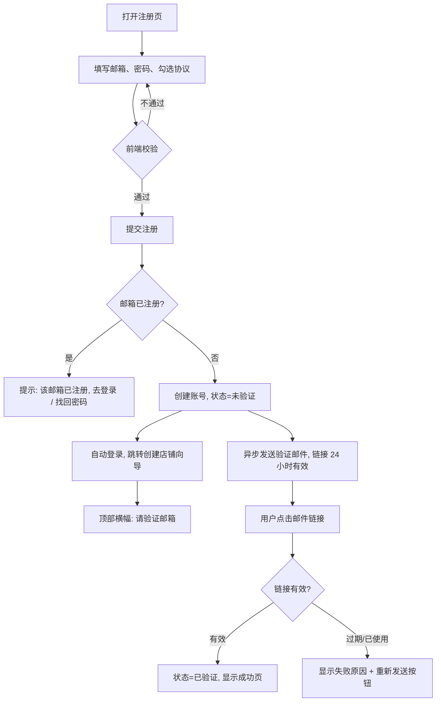
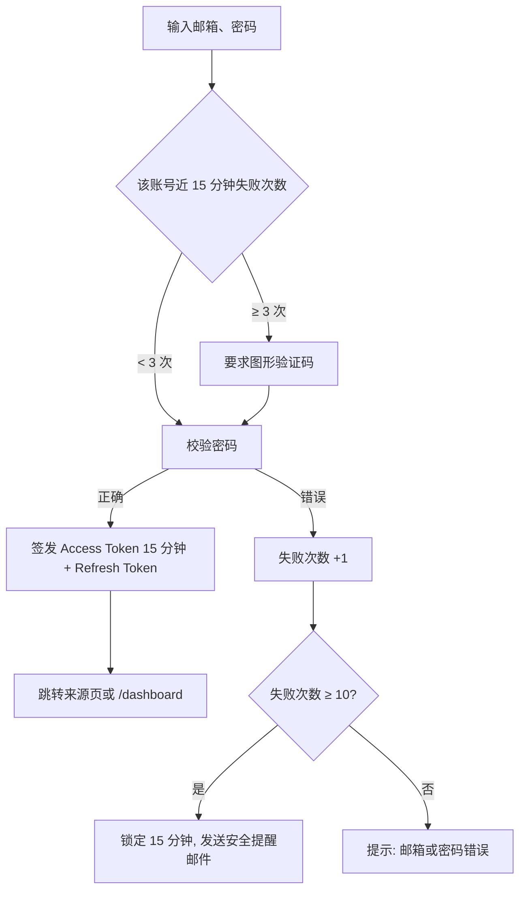
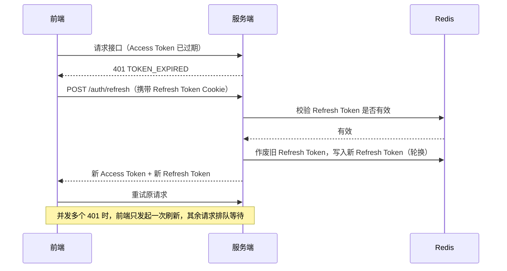
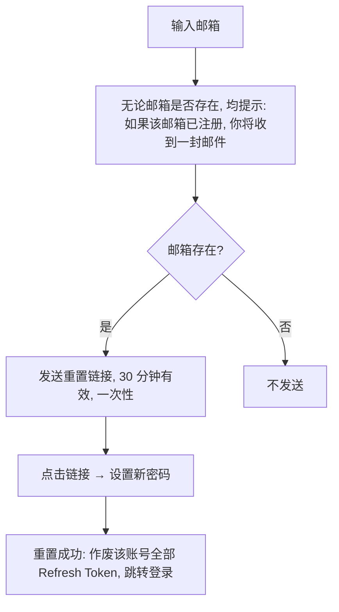

# 01 · 账号与认证（AUTH）

[← 返回总览](./README.md)

## 1. 模块概述
负责商家的注册、登录、邮箱验证、密码管理和会话管理，以及买家查询已购订单时的邮箱验证码身份确认。

## 2. 功能清单

| 编号 | 功能 | 描述 | 优先级 |
|---|---|---|---|
| AUTH-01 | 商家注册 | 邮箱 + 密码注册，同意用户协议 | P0 |
| AUTH-02 | 邮箱验证 | 注册后发送验证邮件，验证后才能开店上架 | P0 |
| AUTH-03 | 登录 | 邮箱 + 密码登录，支持“记住我” | P0 |
| AUTH-04 | 登出 | 主动登出，使当前 Refresh Token 失效 | P0 |
| AUTH-05 | 找回密码 | 通过邮件链接重置密码 | P0 |
| AUTH-06 | 会话管理 | Access Token + Refresh Token 自动续期 | P0 |
| AUTH-07 | 账号与安全 | 修改密码、修改昵称、查看登录设备、退出其他设备 | P1 |
| AUTH-08 | 登录保护 | 连续失败触发图形验证码和临时锁定 | P0 |
| AUTH-09 | 买家邮箱验证码 | 查询已购订单时发送 6 位验证码 | P0 |
| AUTH-10 | 修改邮箱 | 验证新邮箱后才生效 | P2 |
| AUTH-11 | 第三方登录 | GitHub / 微信登录 | P2 |
| AUTH-12 | 注销账号 | 商家申请注销，处理在途订单后删除数据 | P2 |

## 3. 业务流程

### 3.1 注册与邮箱验证

> 设计说明：注册后**直接登录**并允许先创建店铺、编辑商品草稿，降低流失；但**上架商品**必须先验证邮箱。

### 3.2 登录

### 3.3 Token 续期

### 3.4 找回密码

## 4. 页面与交互

### 4.1 注册页 `/register`（AUTH-01）
**布局**：居中单列卡片，宽 400px。顶部 Logo + 标题“创建你的 MkClou 账号” + 副标题“免费开店，零抽成”。底部“已有账号？登录”。

| 字段 | 类型 | 必填 | 校验规则 | 错误文案 |
|---|---|---|---|---|
| 邮箱 | 文本 | 是 | 合法邮箱格式；≤ 254 字符；转小写存储；拒绝一次性邮箱域名 | “请输入有效的邮箱地址” / “暂不支持临时邮箱” |
| 密码 | 密码 | 是 | 8～64 字符；至少包含字母和数字；不能与邮箱相同 | “密码至少 8 位，需包含字母和数字” |
| 同意协议 | 复选框 | 是 | 必须勾选 | “请先阅读并同意用户协议和隐私政策” |

**交互**
- 密码框右侧有显示 / 隐藏切换；下方显示密码强度条（弱 / 中 / 强）。
- 邮箱在失焦时校验格式；提交后才检查是否已注册（防止邮箱枚举，见 SEC-03）。
- 提交按钮：“创建账号”；提交中显示“创建中…”。
- 协议链接新标签页打开。

### 4.2 登录页 `/login`（AUTH-03）
| 字段 | 必填 | 说明 |
|---|---|---|
| 邮箱 | 是 | — |
| 密码 | 是 | — |
| 图形验证码 | 条件 | 失败 3 次后出现 |
| 记住我 | 否 | 勾选后 Refresh Token 有效期 30 天，否则 7 天 |

**交互**
- 密码错误时**不区分**“邮箱不存在”和“密码错误”，统一提示“邮箱或密码错误”。
- 锁定时提示“登录尝试过多，请 15 分钟后再试，或 [找回密码]”，并显示倒计时。
- 登录成功后跳转 `redirect` 参数指定页面（仅允许站内路径，防开放重定向），默认 `/dashboard`。

### 4.3 邮箱验证横幅（AUTH-02）
- 未验证商家在后台所有页面顶部显示 warning 横幅：“验证邮箱后才能上架商品。验证邮件已发送至 a***@qq.com [重新发送]”。
- “重新发送”点击后进入 60 秒倒计时；每个账号每天最多发送 10 次。

### 4.4 账号与安全 `/dashboard/account`（AUTH-07）
- 基本信息：昵称（1～20 字符）、邮箱（只读）、注册时间。
- 修改密码：当前密码 + 新密码 + 确认新密码；修改成功后其他设备全部下线。
- 登录设备：列出设备（浏览器 / 系统、IP 归属地、最近活动时间），当前设备标记“本机”，可单个“退出”或“退出所有其他设备”。

### 4.5 买家邮箱验证码（AUTH-09）
用于 `/orders/lookup` 已购查询，流程见 [05-delivery.md](./05-delivery.md) DLV-06。
- 6 位数字，10 分钟有效，一次性使用。
- 同一邮箱 60 秒内只能发送一次，每天最多 10 次。
- 同一验证码最多输错 5 次，超过后作废，需重新获取。

## 5. 异常与边界

| 场景 | 处理 |
|---|---|
| 注册邮箱大小写不同（`A@qq.com` 与 `a@qq.com`） | 统一转小写，视为同一邮箱 |
| 注册时邮件服务故障 | 账号正常创建，横幅提示“验证邮件发送失败，[重新发送]” |
| 已验证用户再次点击验证链接 | 显示“邮箱已验证”，提供“进入后台”按钮 |
| 验证链接被他人点击 | 链接只用于验证，不会自动登录，不泄露信息 |
| 找回密码时账号被锁定 | 重置密码成功后自动解除锁定 |
| 重置链接已使用或过期 | 显示“链接已失效”，提供“重新发送” |
| 同时在多个标签页登录 / 登出 | 一个标签页登出后，其他标签页在下次请求时跳转登录页（监听 storage 事件同步） |
| Refresh Token 被重复使用（疑似被盗） | 作废该用户全部 Refresh Token，强制重新登录，记录安全日志 |
| 账号被平台封禁 | 登录提示“账号已被停用，原因：xxx。如有疑问请联系 support@…”；已登录的会话立即失效 |
| 浏览器禁用 Cookie | 登录页提示“请开启 Cookie 后再登录” |

## 6. 验收标准
- [ ] 使用新邮箱注册后，自动登录并进入创建店铺向导，邮箱收到验证邮件。
- [ ] 未验证邮箱时，可保存商品草稿，但点击“上架”提示先验证邮箱。
- [ ] 连续输错密码 3 次出现图形验证码，10 次锁定 15 分钟并收到安全提醒邮件。
- [ ] Access Token 过期后，用户无感知地完成续期；Refresh Token 过期后跳转登录页，登录后回到原页面。
- [ ] 找回密码对不存在的邮箱也显示相同提示。
- [ ] 重置密码后，所有已登录设备在下次请求时退出。
