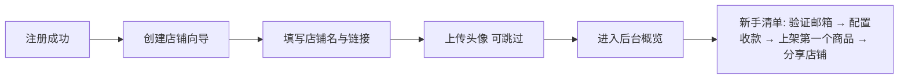
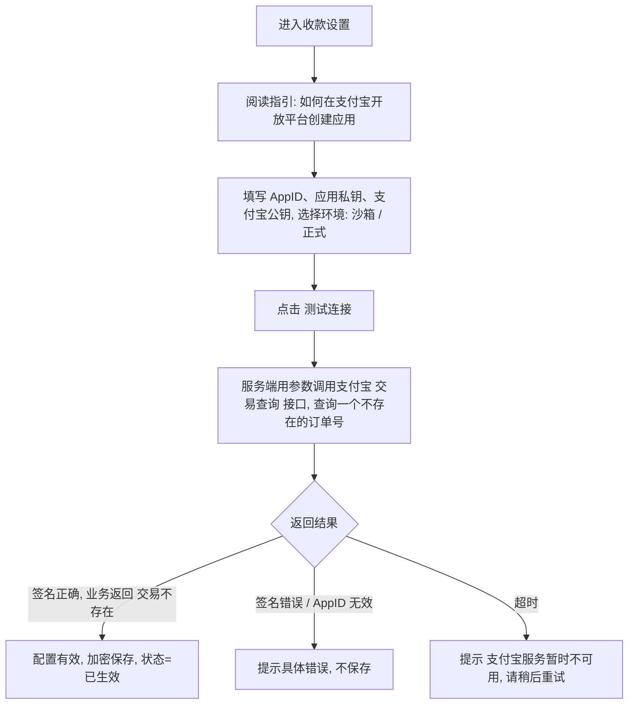

# 02 · 店铺（SHOP）

[← 返回总览](./README.md)

## 1. 模块概述
商家创建和管理自己的店铺：基本信息、品牌装修、收款配置。V1.0 中**一个商家账号只能拥有一个店铺**。

## 2. 功能清单

| 编号 | 功能 | 描述 | 优先级 |
|---|---|---|---|
| SHOP-01 | 创建店铺向导 | 注册后引导填写店铺名、店铺链接、头像 | P0 |
| SHOP-02 | 店铺基本信息 | 名称、链接、简介、头像、联系邮箱 | P0 |
| SHOP-03 | 店铺装修 | 主题色、封面横幅、商品卡片比例、布局模板，带实时预览 | P1 |
| SHOP-04 | 收款配置 | 绑定支付宝开放平台应用参数，测试连接 | P0 |
| SHOP-05 | 新手引导清单 | 后台概览页显示开店进度 | P1 |
| SHOP-06 | 店铺状态 | 营业中 / 暂停营业 / 已封禁 | P0 |
| SHOP-07 | 分享店铺 | 复制链接、生成二维码海报 | P1 |
| SHOP-08 | 自定义域名 | — | P2 |
| SHOP-09 | 多店铺 | — | P2 |

## 3. 业务流程

### 3.1 开店流程

### 3.2 店铺对外可见规则
| 条件 | 买家访问 `/s/{slug}` 的结果 |
|---|---|
| 营业中，且有已上架商品 | 正常展示 |
| 营业中，没有已上架商品 | 显示店铺信息 + 空状态“店主正在准备商品，敬请期待” |
| 暂停营业 | 显示店铺信息 + 横幅“店铺暂停营业中”，商品可浏览但**不可购买** |
| 已封禁 | 显示“该店铺已关闭” |
| 链接不存在 | 404 |

### 3.3 收款配置与验证

## 4. 页面与交互

### 4.1 创建店铺向导 `/onboarding`（SHOP-01）
**布局**：居中单列，顶部步骤条（1 店铺信息 → 2 店铺头像），右侧（桌面端）显示店铺页实时预览缩略图。

| 字段 | 必填 | 校验规则 | 说明 |
|---|---|---|---|
| 店铺名称 | 是 | 2～20 字符；不能包含敏感词 | 例：“阿杰的工具铺” |
| 店铺链接 | 是 | 3～20 字符；仅小写字母、数字、连字符；不能以连字符开头或结尾；不能是保留词；全局唯一 | 前缀固定显示 `mkclou.com/s/` |
| 店铺头像 | 否 | JPG / PNG / WebP，≤ 2MB，裁剪为 1:1 | 不上传则使用店铺名首字生成默认头像 |

**交互**
- 输入店铺名后，自动用拼音或英文生成链接建议（可修改）。
- 链接输入时防抖 500ms 检查是否可用，右侧显示 ✓ 可用 / ✕ 已被占用 + 推荐 3 个可用备选。
- 保留词：`admin`、`api`、`dashboard`、`login`、`register`、`mkclou`、`help`、`support`、`www`、`shop`、`pay` 等，维护于配置文件。

### 4.2 店铺设置 `/dashboard/shop`（SHOP-02、SHOP-03）
**布局**：左侧表单（分组卡片），右侧固定的店铺页实时预览（可切换桌面 / 手机）。底部固定操作栏：“取消” “保存修改”。

**基本信息**
| 字段 | 必填 | 规则 |
|---|---|---|
| 店铺名称 | 是 | 同上 |
| 店铺链接 | 是 | 同上；**每 30 天只能修改一次**；修改后旧链接 301 跳转到新链接 90 天 |
| 店铺简介 | 否 | ≤ 200 字符，纯文本 |
| 联系邮箱 | 是 | 默认为注册邮箱；展示在订单交付页和邮件中，供买家售后联系 |
| 社交链接 | 否 | 最多 4 个（个人网站、GitHub、B 站、小红书等），URL 格式校验 |

**装修（SHOP-03）**
| 配置项 | 选项 | 默认 |
|---|---|---|
| 主题色 | 8 个预设色 + 自定义（自定义色需通过对比度校验 ≥ 4.5:1，否则提示并自动调整） | 设计规范品牌色 |
| 封面横幅 | 上传 3:1 图片，≤ 5MB；或不使用 | 不使用 |
| 商品卡片比例 | 4:3 / 16:9 / 1:1 | 4:3 |
| 布局模板 | 网格（3 列）/ 列表（适合少量商品）| 网格 |
| 明暗模式 | 浅色 / 深色 / 跟随买家系统 | 浅色 |

> 设计原则：只提供**受控**的配置项（区别于面包多的自定义 CSS），保证任何组合都符合设计规范。

### 4.3 收款设置 `/dashboard/payment`（SHOP-04）
**布局**：顶部状态卡片（未配置 / 已生效-沙箱 / 已生效-正式 / 失效），下方为分步指引 + 表单。

| 字段 | 必填 | 说明 |
|---|---|---|
| 环境 | 是 | 沙箱 / 正式。沙箱模式下，店铺页顶部显示“测试模式，付款不会产生真实扣费” |
| AppID | 是 | 16 位数字 |
| 应用私钥 | 是 | 多行文本；保存后**不再明文回显**，显示为 `已保存（MIIEv…末尾 6 位）`，可“替换” |
| 支付宝公钥 | 是 | 多行文本 |

**交互**
- “测试连接”通过后“保存”按钮才可用。
- 保存后的私钥使用 AES-256-GCM 加密存储，见 SEC-06。
- 收款未生效时：可以创建商品草稿，但**上架**时提示“请先完成收款设置”（免费商品除外）。
- 页面顶部说明资金规则：“买家付款将直接进入你的支付宝账户，MkClou 不经手、不抽成”。

### 4.4 新手引导清单（SHOP-05）
位于后台概览页顶部，全部完成后可收起。

| 步骤 | 完成条件 | 操作按钮 |
|---|---|---|
| 1. 验证邮箱 | 邮箱已验证 | 重新发送邮件 |
| 2. 配置收款 | 收款状态为已生效 | 去配置 |
| 3. 上架第一个商品 | 至少 1 个已上架商品 | 去上架 |
| 4. 分享你的店铺 | 点击过复制链接或生成海报 | 复制链接 |

### 4.5 店铺状态（SHOP-06）
- 商家可在店铺设置中切换“暂停营业”，需填写可选的暂停说明（≤ 100 字符），展示给买家。
- 暂停营业时，未支付订单仍可完成支付（避免买家已扫码却支付失败），新订单不可创建。

### 4.6 分享店铺（SHOP-07）
- 复制链接：点击后 Toast“链接已复制”。
- 海报：自动生成包含店铺头像、名称、简介、二维码的竖版图片（1080×1920），可下载。

## 5. 异常与边界

| 场景 | 处理 |
|---|---|
| 两个商家同时提交同一个店铺链接 | 数据库唯一约束兜底，后提交者提示“该链接刚刚被占用，请换一个” |
| 修改店铺链接后，买家使用旧链接访问 | 90 天内 301 跳转到新链接；之后旧链接可被他人使用 |
| 头像或封面上传失败 | 保留原图，提示失败原因（格式 / 大小 / 网络），可重试 |
| 上传的图片包含违规内容 | V1.0 依赖举报 + 人工审核；V2 接入内容安全接口 |
| 收款参数在支付宝侧被删除或失效 | 下单时调用失败 → 买家看到“店铺收款暂不可用，请联系店主”；系统给商家发送邮件，收款状态改为“失效” |
| 从沙箱切换到正式环境 | 需重新填写并测试正式参数；沙箱期间产生的订单标记为“测试订单”，不计入统计 |
| 商家离开页面时有未保存修改 | 弹窗确认 |

## 6. 验收标准
- [ ] 新商家注册后完成向导，可通过 `/s/{slug}` 访问自己的店铺。
- [ ] 店铺链接实时校验可用性，保留词与重复链接无法使用。
- [ ] 修改主题色、卡片比例后，右侧预览实时更新，保存后店铺页生效。
- [ ] 填写错误的支付宝参数，测试连接给出明确错误；正确参数测试通过后才能保存。
- [ ] 私钥保存后接口与页面均不返回明文。
- [ ] 暂停营业后，买家可浏览商品但购买按钮禁用并显示原因。
