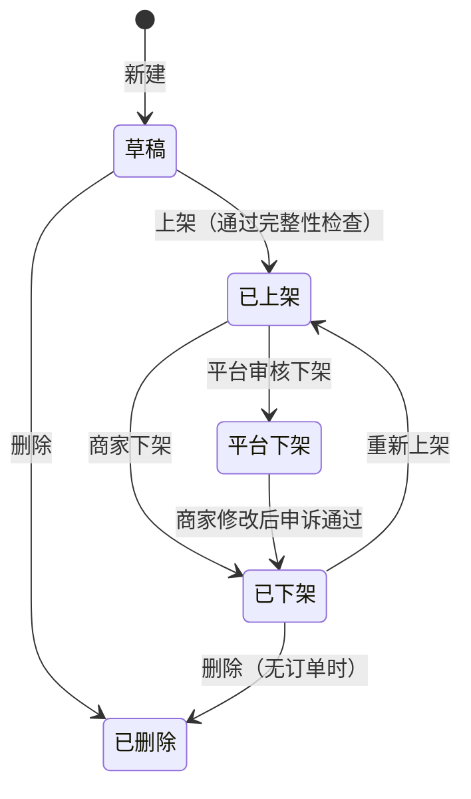

# 03 · 商品（PRD）

[← 返回总览](./README.md)

## 1. 模块概述
商家创建、编辑、上下架虚拟商品，配置交付内容和库存。商品详情采用**结构化描述**，由平台统一排版（区别于 Gumroad 自由排版导致的页面杂乱）。

## 2. 功能清单

| 编号 | 功能 | 描述 | 优先级 |
|---|---|---|---|
| PRD-01 | 商品列表 | 搜索、筛选、排序、批量操作 | P0 |
| PRD-02 | 新建 / 编辑商品 | 基本信息、图片、价格、描述、交付内容 | P0 |
| PRD-03 | 交付类型：文件 | 上传 1～5 个文件 | P0 |
| PRD-04 | 交付类型：链接 | 网盘链接、在线文档链接 + 提取码 | P0 |
| PRD-05 | 交付类型：文本 | 付款后显示的一段 Markdown 文本 | P0 |
| PRD-06 | 交付类型：卡密 | 每单分配唯一卡密，支持购买数量 | P0 |
| PRD-07 | 卡密库存管理 | 批量导入、去重、查看、删除未售卡密、导出 | P0 |
| PRD-08 | 上架 / 下架 | 状态切换，上架前完整性检查 | P0 |
| PRD-09 | 商品预览 | 以买家视角预览未上架商品 | P1 |
| PRD-10 | 划线原价 | 设置原价用于展示优惠 | P1 |
| PRD-11 | 库存预警 | 卡密库存低于阈值时邮件提醒 | P1 |
| PRD-12 | 商品排序 | 拖拽调整店铺中的展示顺序 | P1 |
| PRD-13 | 复制商品 | 一键复制为新草稿（不含卡密） | P1 |
| PRD-14 | 免费商品 | 0 元商品，填写邮箱即可领取（引流品） | P1 |
| PRD-15 | 删除商品 | 软删除，有订单的商品只能下架不能删除 | P0 |
| PRD-16 | 授权码（License Key） | 自动生成授权码 + 验证 API | P2（V1.1） |
| PRD-17 | 随心付 | 买家自定义价格（设最低价） | P2（V1.1） |
| PRD-18 | 商品分类 | 选择平台一级分类（MKT-04），用于商城首页与搜索筛选；店铺内自定义标签仍为 P2 | P0（v1.1） |

## 3. 商品状态

| 状态 | 买家可见 | 可购买 | 商家可编辑 |
|---|---|---|---|
| 草稿 | 否（仅预览链接） | 否 | 是 |
| 已上架 | 是 | 是（库存充足时） | 是，修改**即时生效** |
| 已下架 | 否；直接访问链接显示“商品已下架” | 否 | 是 |
| 平台下架 | 否 | 否 | 是，需提交申诉 |
| 已删除 | 否 | 否 | 否 |

> 已上架商品被修改时，**已完成订单的交付内容不受影响**：订单在支付成功时保存交付内容快照（文件引用、链接、文本），见 DLV-01。

## 4. 页面与交互

### 4.1 商品列表 `/dashboard/products`（PRD-01）
**布局**：页面标题“商品” + 右上角主按钮“新建商品”；状态 Tab（全部 / 已上架 / 草稿 / 已下架）；搜索框；表格。

| 列 | 内容 |
|---|---|
| 商品 | 封面缩略图 48×48 + 名称 + 交付类型小标签 |
| 价格 | `¥ 29.90`，有原价时下方显示划线原价 |
| 库存 | 卡密商品显示剩余数量（低于阈值显示 warning 色）；其他类型显示“不限” |
| 销量 | 累计已支付订单数 |
| 状态 | 状态标签 |
| 更新时间 | 相对时间 |
| 操作 | 编辑、预览、复制链接；“更多”菜单：上架 / 下架、复制商品、删除 |

**交互**
- 支持多选批量上架 / 下架。
- 搜索按商品名称模糊匹配，防抖 300ms。
- 空状态：“还没有商品，上架你的第一个作品吧 [新建商品]”。
- 筛选结果为空：“没有找到匹配的商品 [清除筛选]”。

### 4.2 新建 / 编辑商品 `/dashboard/products/new`（PRD-02）
**布局**：左侧表单（分组卡片，可滚动），右侧为**买家视角实时预览**（桌面端）。顶部操作栏：返回、状态标签、“保存草稿”、主按钮“上架”/“保存”。
表单每 30 秒自动保存草稿，顶部显示“已自动保存 · 刚刚”。

#### 分组 1：基本信息
| 字段 | 必填 | 规则 |
|---|---|---|
| 商品名称 | 是 | 2～60 字符 |
| 商品分类 | 上架时必填 | 平台一级分类，见 MKT-04 |
| 一句话卖点 | 否 | ≤ 80 字符，显示在价格下方 |
| 封面图 | 上架时必填 | 1～6 张；JPG / PNG / WebP / GIF；单张 ≤ 5MB；按店铺卡片比例裁剪；第一张为主图；可拖拽排序 |

#### 分组 2：价格
| 字段 | 必填 | 规则 |
|---|---|---|
| 价格 | 是 | 0 或 0.01～50,000.00；最多两位小数；输入 0 时提示“将作为免费商品，买家填写邮箱即可领取” |
| 划线原价 | 否 | 必须大于价格 |
| 单次限购数量 | 卡密类型显示 | 1～20，默认 1 |

#### 分组 3：商品描述（结构化）
| 区块 | 必填 | 说明 |
|---|---|---|
| 商品介绍 | 上架时必填 | Markdown 编辑器（支持标题、加粗、列表、链接、图片、代码块），≤ 5000 字符；工具栏 + 实时预览 |
| 包含内容 | 否 | 列表形式，最多 10 项，每项 ≤ 50 字符，例如“3 套 Figma 模板” |
| 适合谁 | 否 | ≤ 200 字符 |
| 常见问题 | 否 | 最多 8 组问答，问 ≤ 50 字符，答 ≤ 300 字符 |
| 购买须知 | 否 | ≤ 300 字符，例如“虚拟商品，交付后不支持退款” |

平台按固定版式渲染以上区块，保证页面整洁一致。

#### 分组 4：交付内容
顶部为交付类型单选卡片（图标 + 名称 + 一句说明）。**商品上架后不能修改交付类型**（避免已售订单出现不一致），如需修改请复制商品。

**文件（PRD-03）**
- 拖拽或点击上传，1～5 个文件，单个 ≤ 200MB，总计 ≤ 500MB。
- 允许格式：zip、rar、7z、pdf、epub、png、jpg、psd、ai、fig、sketch、mp3、mp4、ttf、otf、txt、md 等（白名单维护在配置中）。软件安装包（exe、msi、dmg、apk）允许上传，但交付页会显示安全提示；脚本类文件（bat、cmd、vbs、ps1、js、sh）一律禁止上传。
- 上传使用分片上传（每片 5MB），显示进度条、速度、剩余时间，可取消；断网后可续传。
- 上传完成后显示文件名、大小，可重命名（展示给买家的名称）、删除、调整顺序。
- 单个订单下载次数上限：默认 5 次，可设置 1～20 次或“不限”。

**链接（PRD-04）**
| 字段 | 必填 | 规则 |
|---|---|---|
| 链接地址 | 是 | 合法 http/https URL；最多 5 个 |
| 链接名称 | 否 | 例如“百度网盘” |
| 提取码 / 密码 | 否 | ≤ 20 字符 |

**文本（PRD-05）**
- Markdown 编辑器，≤ 5000 字符，付款后在交付页和邮件中显示。适合发送使用说明、群号、激活方法等。

**卡密（PRD-06）**
- 卡密商品在本页只显示库存概况（剩余 / 已售 / 已预占）和“管理卡密”按钮，跳转卡密库存页。
- 可填写“卡密使用说明”（Markdown，≤ 1000 字符），随卡密一起交付。
- 库存预警阈值：默认 5，可设置 0～999（0 表示不提醒）。

**所有类型通用**：可选填“交付附言”（≤ 500 字符），显示在交付内容上方，例如“感谢购买！有问题请邮件联系我”。

#### 上架完整性检查（PRD-08）
点击“上架”时检查以下条件，未通过的项在弹窗中逐条列出，点击可定位到对应字段：
- [ ] 邮箱已验证
- [ ] 收款已配置（价格为 0 时跳过）
- [ ] 已选择商品分类
- [ ] 至少 1 张封面图
- [ ] 商品介绍不为空
- [ ] 交付内容已配置（文件已全部上传完成 / 至少 1 个链接 / 文本不为空 / 卡密库存 ≥ 1）
- [ ] 内容未命中敏感词（命中则进入“待审核”，见 ADM-04）

### 4.3 卡密库存 `/dashboard/products/{id}/cards`（PRD-07）
**布局**：顶部统计卡片（可售 / 已预占 / 已售 / 总计）；操作区：“导入卡密”“导出”；状态筛选 Tab；表格。

**导入方式**
1. 文本粘贴：每行一个卡密（可选格式 `卡号----密码`，以 4 个连字符分隔）。
2. 上传 TXT / CSV 文件（≤ 2MB）。

**导入规则**
- 单次最多 5000 条；每条 1～500 字符；自动去除首尾空格和空行。
- 去重：本次导入内部去重 + 与该商品已有卡密去重。
- 导入前显示**预检结果**：“共 1000 行，有效 985 条，重复 12 条，空行 2 条，超长 1 条”，可展开查看问题明细，确认后再导入。
- 导入是事务性的：要么全部有效卡密导入成功，要么全部失败。

**表格列**：卡密（默认脱敏显示 `ABCD****WXYZ`，点击眼睛图标显示完整）、状态（可售 / 已预占 / 已售）、关联订单号、导入时间、售出时间。

**操作**
- 删除：只能删除“可售”状态的卡密，支持批量；需二次确认。
- 导出：导出 CSV，可选“全部 / 可售 / 已售”。导出操作记录审计日志。
- 已售、已预占卡密不可删除或编辑。

### 4.4 商品预览（PRD-09）
- 草稿和已下架商品可通过“预览”打开买家视角页面，顶部固定横幅“预览模式，买家无法看到此页面”，购买按钮禁用。
- 预览链接带有临时令牌，有效期 1 小时，仅商家本人可用。

## 5. 异常与边界

| 场景 | 处理 |
|---|---|
| 编辑时文件仍在上传，点击保存 | 提示“有 2 个文件仍在上传，完成后再保存”；可选择“取消上传并保存” |
| 上传中关闭页面 | 浏览器原生离开确认；已上传分片保留 24 小时，重新进入可续传 |
| 两个标签页同时编辑同一商品 | 乐观锁（版本号）：后保存者提示“商品已在其他页面被修改，[查看最新版本] / [覆盖保存]” |
| 已上架商品删除最后一个文件 / 链接 | 阻止保存：“已上架商品至少需要一项交付内容，如需修改请先下架” |
| 卡密库存为 0 | 商品仍然上架，买家端显示“已售罄”，购买按钮禁用；同时给商家发送售罄邮件 |
| 有预占卡密时删除商品 | 不允许删除，提示“有进行中的订单，请稍后再试” |
| 修改价格时有买家正在结账 | 订单以**下单时**价格为准；结账页提交时若价格已变，提示“商品价格已更新为 ¥xx，请确认” |
| 下架商品时有未支付订单 | 未支付订单可在剩余时间内继续完成支付并交付；不再接受新订单 |
| 商品有订单后点击删除 | 提示“该商品已有订单，无法删除，可选择下架”，提供“下架”按钮 |
| 封面图比例与店铺设置不符 | 上传后弹出裁剪器，强制按店铺比例裁剪 |
| Markdown 中插入外部图片 | 允许 https 图片；V1.0 不转存，后续版本转存到自有存储 |

## 6. 验收标准
- [ ] 四种交付类型的商品都能创建、预览、上架。
- [ ] 上架时缺少必填项，弹窗逐条列出并可定位。
- [ ] 200MB 文件可分片上传，断网恢复后可续传。
- [ ] 导入 1000 条含重复的卡密，预检结果准确，确认后只导入有效条目。
- [ ] 已售卡密无法删除；导出操作被记录到审计日志。
- [ ] 修改已上架商品的文件，之前的订单仍能下载原文件。
- [ ] 卡密售罄时，买家端显示“已售罄”，商家收到邮件。
