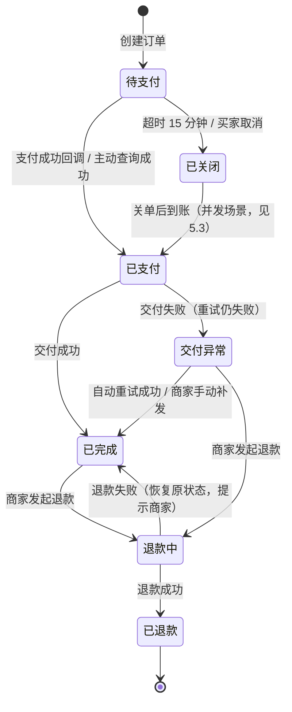
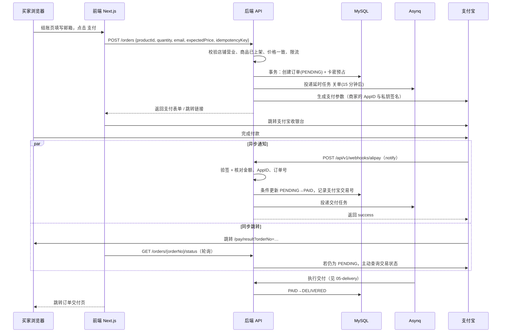
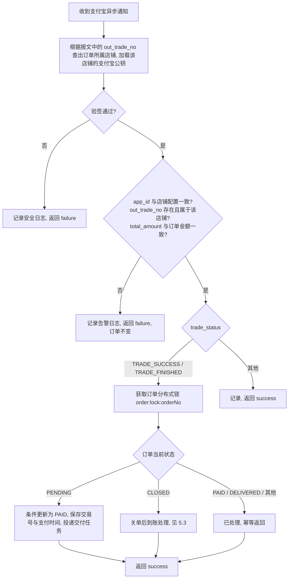
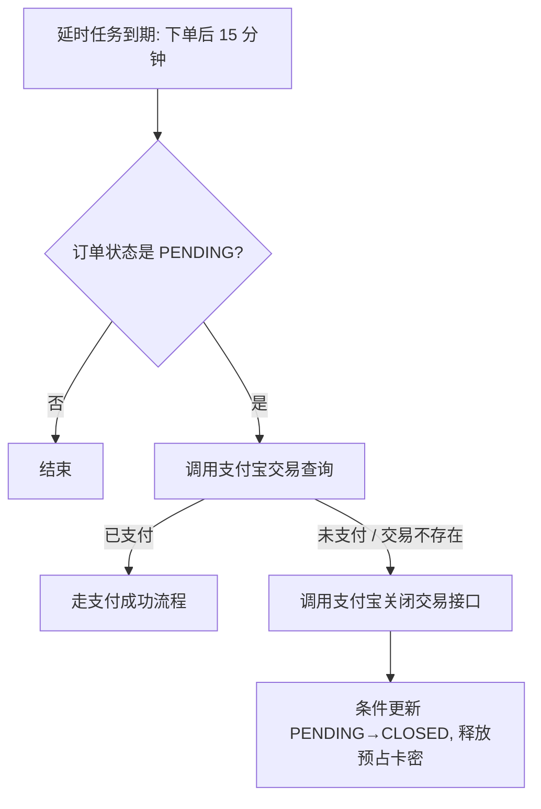
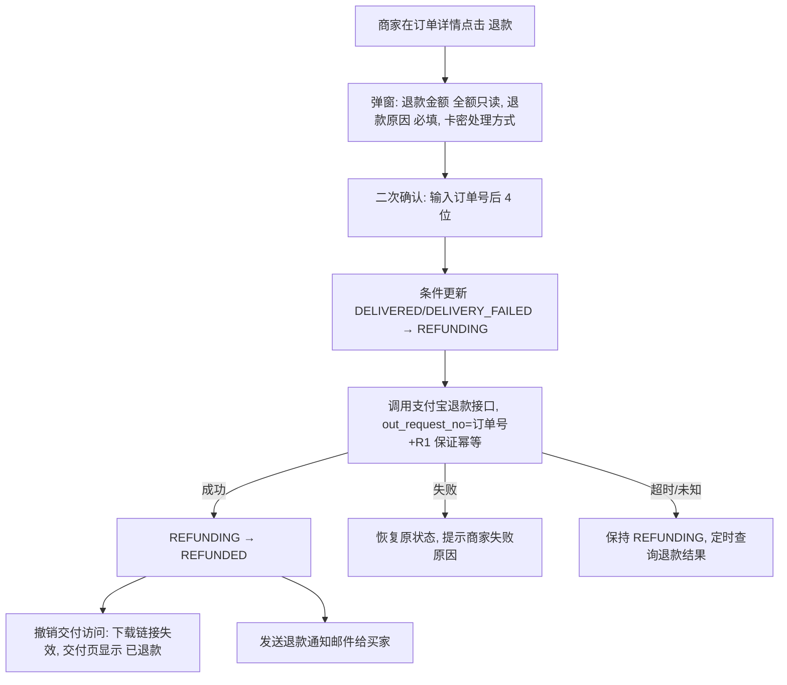
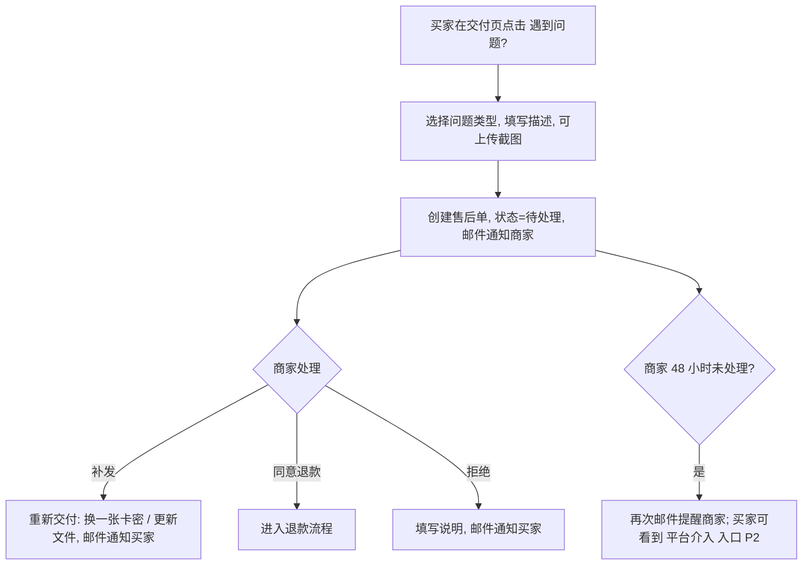

# 04 · 订单、支付与售后（ORD）

[← 返回总览](./README.md)

## 1. 模块概述
负责从买家下单到资金完成的全过程：创建订单、库存预占、调起支付宝、处理支付回调、超时关单、退款和售后。**这是系统中一致性要求最高的模块**：不能重复交付、不能超卖、不能丢单。

**资金规则**：买家付款通过商家自己配置的支付宝应用完成，资金直接进入商家支付宝账户。MkClou 只负责下单、验证支付结果和交付，不经手资金。

## 2. 功能清单

| 编号 | 功能 | 描述 | 优先级 |
|---|---|---|---|
| ORD-01 | 创建订单 | 校验商品、价格、库存，生成订单 | P0 |
| ORD-02 | 库存预占 | 卡密商品下单时预占库存，超时释放 | P0 |
| ORD-03 | 调起支付 | 电脑端：支付宝电脑网站支付；手机端：支付宝手机网站支付 | P0 |
| ORD-04 | 支付回调 | 异步通知验签、金额核对、幂等处理、触发交付 | P0 |
| ORD-05 | 主动查询 | 同步跳转返回时主动查询；定时补偿查询漏掉的回调 | P0 |
| ORD-06 | 超时关单 | 15 分钟未支付自动关闭，释放预占库存 | P0 |
| ORD-07 | 免费订单 | 0 元商品跳过支付直接交付 | P1 |
| ORD-08 | 继续支付 | 未支付订单可在有效期内重新调起支付 | P0 |
| ORD-09 | 买家取消订单 | 未支付订单可取消 | P1 |
| ORD-10 | 订单列表（商家） | 筛选、搜索、导出 | P0 |
| ORD-11 | 订单详情（商家） | 订单信息、交付记录、操作日志 | P0 |
| ORD-12 | 商家退款 | 全额原路退回 | P0 |
| ORD-13 | 新订单通知 | 商家收到新订单邮件（可关闭） | P1 |
| ORD-14 | 售后申请（买家） | 买家在交付页提交售后申请 | P1 |
| ORD-15 | 售后处理（商家） | 同意退款 / 补发 / 拒绝并说明 | P1 |
| ORD-16 | 对账 | 每日对账，比对支付宝账单与订单 | P2 |
| ORD-17 | 部分退款 | — | P2 |
| ORD-18 | 当面付扫码 | 电脑端在结账页内直接展示支付二维码 | P2 |

## 3. 订单状态机



| 状态 | 编码 | 说明 | 买家可见文案 |
|---|---|---|---|
| 待支付 | `PENDING` | 已创建，等待支付 | 待支付（剩余 mm:ss） |
| 已支付 | `PAID` | 已确认收款，交付处理中（通常 < 3 秒） | 正在为你准备商品… |
| 已完成 | `DELIVERED` | 交付内容已生成 | 已完成 |
| 交付异常 | `DELIVERY_FAILED` | 已收款但交付失败 | 商品准备中，店主会尽快处理 |
| 已关闭 | `CLOSED` | 超时或取消 | 订单已关闭 |
| 退款中 | `REFUNDING` | 已向支付宝发起退款 | 退款处理中 |
| 已退款 | `REFUNDED` | 资金已原路退回 | 已退款 |

**状态流转规则**
- 所有状态变更通过**条件更新**实现：`UPDATE orders SET status='PAID' … WHERE order_no=? AND status='PENDING'`，影响行数为 0 则说明已被其他流程处理，直接返回当前状态（幂等）。
- 每次状态变更写入 `order_events` 表（时间、原状态、新状态、触发来源、操作人），用于订单详情页的时间线和问题排查。

## 4. 业务流程

### 4.1 下单与支付（主流程）


### 4.2 创建订单的校验顺序（ORD-01）
1. **幂等键**：前端在进入结账页时生成 `idempotencyKey`（UUID）。同一个键 10 分钟内重复提交，直接返回已创建的订单。
2. 限流：同一 IP 每分钟最多创建 10 单；同一邮箱同一商品未支付订单最多 3 个（见 SEC-02）。
3. 店铺状态为营业中、收款已生效。
4. 商品状态为已上架。
5. 价格校验：`expectedPrice` 与当前价格不一致时，返回 `PRICE_CHANGED` 和最新价格。
6. 数量校验：1 ≤ 数量 ≤ 单次限购（非卡密商品数量固定为 1）。
7. 邮箱格式校验。
8. 卡密商品：事务内预占库存（ORD-02）。

### 4.3 卡密预占（ORD-02）
```sql
-- 在下单事务中执行，SKIP LOCKED 避免多个下单请求互相等待
SELECT id FROM cards
WHERE product_id = ? AND status = 'AVAILABLE'
ORDER BY id
LIMIT ?            -- 购买数量
FOR UPDATE SKIP LOCKED;

UPDATE cards SET status = 'RESERVED', order_id = ?, reserved_at = NOW()
WHERE id IN (...);
```
- 取到的数量少于购买数量 → 事务回滚，返回 `OUT_OF_STOCK`（剩余 N 件）。
- 关单时：`RESERVED → AVAILABLE`，清空 `order_id`。
- 交付时：`RESERVED → SOLD`。
- 面试要点：对比“先查库存再扣减”的超卖问题、乐观锁方案、Redis 预扣方案的取舍。

### 4.4 支付回调处理（ORD-04）

- 回调地址统一为 `/api/v1/webhooks/alipay`，不包含店铺 ID（避免暴露内部 ID）。每个店铺使用各自的支付宝密钥，因此先按 `out_trade_no` 定位店铺再验签；验签前报文中的任何字段都不可信，伪造的报文无法通过对应店铺公钥的验签。
- 只有返回 `success` 支付宝才停止重试；处理失败（如数据库异常）返回 `failure`，由支付宝按其策略重试。
- 回调原文全部存入 `payment_notifications` 表，保留 180 天。

### 4.5 主动查询与补偿（ORD-05）
| 触发时机 | 行为 |
|---|---|
| 买家从支付宝跳转回 `/pay/result` | 前端每 2 秒轮询订单状态，最多 30 秒；后端发现订单仍为 PENDING 时调用支付宝交易查询（同一订单 5 秒内最多查一次） |
| 定时补偿任务（每 2 分钟） | 查询创建 3～20 分钟、仍为 PENDING 的订单，调用交易查询；已支付则按回调流程处理 |
| 关单前 | 关单任务先查询一次交易状态，已支付则不关单 |

### 4.6 超时关单（ORD-06）

- 兜底：定时任务每 5 分钟扫描超过 20 分钟仍为 PENDING 的订单，防止延时任务丢失。

### 4.7 退款（ORD-12）


**卡密处理方式**（仅卡密商品）
- 默认：卡密保持“已售”，不回到库存（买家已看到卡密，可能已使用）。
- 商家确认“卡密未被使用”时，可选择“退回库存”。

**退款限制**
- 只支持全额退款（部分退款 P2）。
- 支付宝退款期限：交易成功后 3 个月内（以支付宝规则为准），超期按钮置灰并提示原因。
- 测试订单（沙箱）同样可退款，用于测试。

### 4.8 售后（ORD-14、ORD-15）
虚拟商品的售后主要是：内容无法下载、卡密无效、与描述不符。



| 问题类型 | 说明 |
|---|---|
| 无法下载 / 链接失效 | — |
| 卡密无效或已被使用 | — |
| 内容与描述不符 | — |
| 重复购买 | — |
| 其他 | — |

- 每个订单同时只能有 1 个处理中的售后单；售后单关闭后 7 天内可再次申请。
- 售后单状态：待处理 → 已补发 / 已退款 / 已拒绝 → 已关闭。

## 5. 异常与边界

### 5.1 下单阶段
| 场景 | 处理 |
|---|---|
| 网络抖动导致重复点击支付 | 按钮 loading 禁用 + 幂等键，后端只创建一个订单 |
| 下单时商品刚被下架 | 返回 `PRODUCT_UNAVAILABLE`，结账页显示“商品已下架” |
| 下单时价格已变 | 返回最新价格，弹窗“价格已更新为 ¥xx，是否继续？” |
| 卡密库存不足（含并发抢最后一张） | 返回 `OUT_OF_STOCK`，显示“库存不足，仅剩 N 件”，自动调整可选数量 |
| 商家收款配置失效 | 返回 `PAYMENT_UNAVAILABLE`，提示“店铺暂时无法收款，请联系店主”，并邮件通知商家 |
| 同一买家同一商品存在未支付订单 | 结账页提示“你有一个未完成的订单，[继续支付] / [重新下单]” |

### 5.2 支付阶段
| 场景 | 处理 |
|---|---|
| 买家支付后直接关闭页面 | 不影响：异步回调 + 补偿查询会完成订单，交付邮件照常发送 |
| 异步回调早于同步跳转到达 | 正常，结果页轮询直接拿到已完成状态 |
| 异步回调一直未到达 | 同步跳转时主动查询 + 定时补偿查询兜底 |
| 回调重复到达 | 条件更新 + 分布式锁保证只处理一次 |
| 回调金额与订单不一致 | 不改变订单状态，记录告警，后台标记“金额异常”待人工处理 |
| 伪造回调 | 验签失败，拒绝并记录安全日志（包含来源 IP） |
| 支付宝接口超时 | 调起支付失败时提示“支付服务繁忙，请重试”；订单保留，可继续支付 |

### 5.3 关单与到账的并发
**场景**：买家在第 14 分 59 秒付款，关单任务在第 15 分钟执行。
- 关单前先查询交易状态并调用支付宝“关闭交易”接口，绝大多数情况下可以避免。
- 若仍出现“订单已关闭但收到支付成功回调”：
  1. 尝试重新预占库存（卡密商品）；
  2. 预占成功 → 订单 `CLOSED → PAID`，正常交付；
  3. 预占失败（库存已售完）→ 自动发起全额退款，邮件通知买家“商品已售罄，款项已原路退回”，并通知商家。

### 5.4 退款阶段
| 场景 | 处理 |
|---|---|
| 商家重复点击退款 | 条件更新只允许一次进入 REFUNDING；`out_request_no` 固定保证支付宝侧幂等 |
| 商家支付宝账户余额不足 | 支付宝返回失败，提示“退款失败：支付宝账户余额不足”，订单恢复原状态 |
| 退款结果未知 | 保持 REFUNDING，每 5 分钟查询一次，最多 24 小时，期间按钮禁用并显示“退款处理中” |

## 6. 页面与交互

### 6.1 订单列表 `/dashboard/orders`（ORD-10）
**布局**：标题“订单” + 右上角“导出”；状态 Tab（全部 / 待支付 / 已完成 / 交付异常 / 退款 / 已关闭），交付异常显示红色数字角标；筛选：时间范围、商品、关键字（订单号 / 买家邮箱）；表格。

| 列 | 内容 |
|---|---|
| 订单号 | 等宽字体，可一键复制 |
| 商品 | 名称 × 数量 |
| 买家 | 邮箱（列表脱敏 `a***@qq.com`，详情页显示完整） |
| 金额 | 右对齐，等宽数字 |
| 状态 | 状态标签；测试订单额外显示“测试”标签 |
| 下单时间 | — |
| 操作 | 查看详情 |

- 默认按下单时间倒序，每页 20 条，分页。
- 导出 CSV：最多导出 10,000 条，超过时提示缩小时间范围；导出记录审计日志。
- 空状态：“还没有订单，分享你的店铺来获得第一笔订单吧 [复制店铺链接]”。

### 6.2 订单详情 `/dashboard/orders/{orderNo}`（ORD-11）
**布局**：左侧主区域，右侧操作栏。
- **订单信息**：订单号、状态、商品快照（名称、价格、数量）、实付金额、买家邮箱、下单时间、支付时间、支付宝交易号、来源（店铺页 / 直接链接 / UTM 来源）。
- **交付信息**：交付类型、交付时间、下载次数（已用 3 / 5）、发送的卡密（脱敏，可点击查看）、交付邮件发送状态（已送达 / 发送失败 + 重发按钮）。
- **时间线**：来自 `order_events`，如“10:01 创建订单 → 10:02 支付成功 → 10:02 交付完成 → 10:02 交付邮件已发送”。
- **操作**：重发交付邮件、重置下载次数、补发（交付异常时）、退款。

## 7. 验收标准
- [ ] 沙箱环境完成一次完整购买，3 秒内跳转到交付页并收到邮件。
- [ ] 重复发送同一个支付回调 10 次，订单只交付一次。
- [ ] 伪造签名的回调被拒绝，订单状态不变，日志中有记录。
- [ ] 100 个并发请求抢购库存为 10 的卡密商品，恰好 10 单成功，无超卖。
- [ ] 下单 15 分钟不支付，订单自动关闭，预占卡密回到可售状态。
- [ ] 支付完成后立即关闭浏览器，订单仍然完成交付并发送邮件。
- [ ] 商家退款成功后，买家收到通知，交付页显示“已退款”，下载链接失效。
- [ ] 买家提交售后申请后，商家收到邮件，补发卡密后买家收到新卡密。
