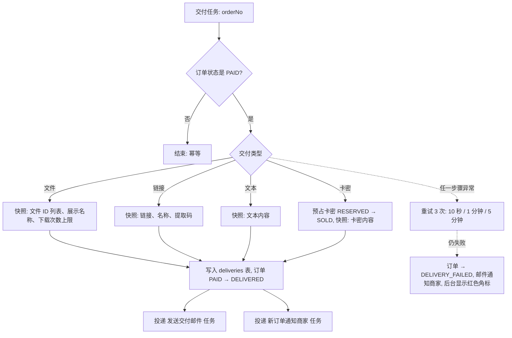
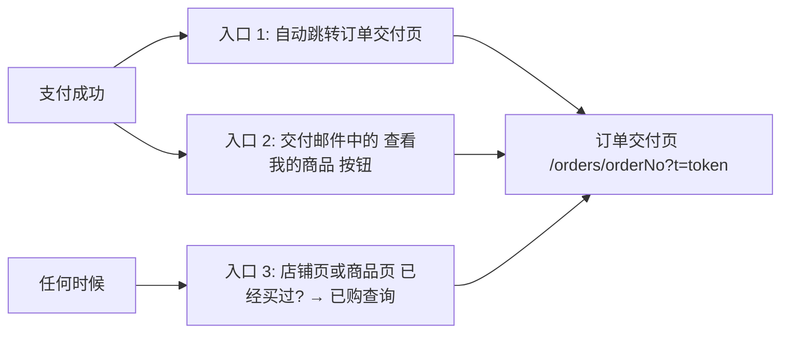
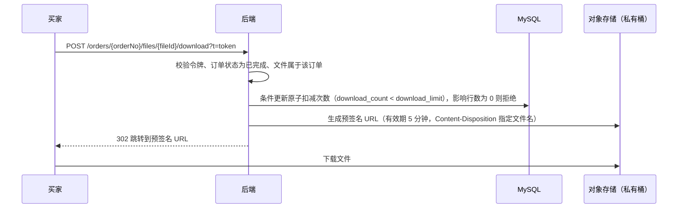
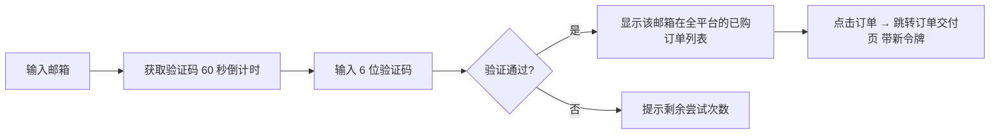

# 05 · 交付（DLV）

[← 返回总览](./README.md)

## 1. 模块概述
买家支付成功后，系统自动生成交付内容，通过**订单交付页**和**邮件**提供给买家；同时通过签名链接、下载次数限制等手段防止内容被滥用。买家无需注册，可随时凭邮箱找回已购商品。

## 2. 功能清单

| 编号 | 功能 | 描述 | 优先级 |
|---|---|---|---|
| DLV-01 | 自动交付 | 支付成功后异步执行，生成交付快照 | P0 |
| DLV-02 | 订单交付页 | 凭订单令牌免登录访问，展示交付内容 | P0 |
| DLV-03 | 交付邮件 | 发送订单信息与交付页入口 | P0 |
| DLV-04 | 安全下载 | 私有存储 + 短时签名链接 + 下载次数限制 | P0 |
| DLV-05 | 交付重试与补发 | 失败自动重试；商家手动补发 | P0 |
| DLV-06 | 已购查询 | 邮箱 + 验证码查询该邮箱的全部订单 | P0 |
| DLV-07 | 卡密展示 | 一键复制、全部复制、导出 TXT | P0 |
| DLV-08 | 邮件通知中心 | 全部系统邮件模板与发送记录 | P0 |
| DLV-09 | 赠送给朋友 | 结账时填写收礼人邮箱，交付给对方 | P2 |
| DLV-10 | PDF 买家水印 | 下载时在 PDF 中加入买家邮箱和订单号 | P2（V1.1） |
| DLV-11 | 授权码交付 | 配合 PRD-16 | P2（V1.1） |

## 3. 业务流程

### 3.1 自动交付（DLV-01）


**为什么需要快照**：商家之后可能修改或删除商品的交付内容，订单保存的是支付成功时的内容，保证买家买到的东西不会被“偷换”，商家修改商品也不影响历史订单。文件被商家从商品中移除后，存储中的对象保留至所有引用它的订单都已退款或超过 1 年。

### 3.2 买家获取商品的三个入口


### 3.3 安全下载（DLV-04）

- 存储桶为**私有**，文件不能通过固定 URL 访问。
- 预签名 URL 5 分钟后失效，被转发也很快无效。
- 下载次数按“文件 × 订单”计数；同一 IP 30 秒内重复下载同一文件不重复计数（避免浏览器重试或断点续传误计）。
- 每次下载记录：时间、IP、User-Agent，商家可在订单详情中查看，用于判断是否被分享。

## 4. 页面与交互

### 4.1 订单交付页 `/orders/{orderNo}?t={token}`（DLV-02）
**访问控制**：
- `token` 为 32 字节随机数，Base62 编码，服务端只存储其哈希值。
- 令牌错误或缺失 → 显示“链接无效”，引导使用已购查询。
- 页面设置 `noindex`，禁止搜索引擎收录；响应头 `Referrer-Policy: no-referrer`，防止令牌通过 Referer 泄露。

**布局**（单列居中，最大宽度 640px，遵循店铺主题色）：
```
┌─────────────────────────────────────┐
│ 店铺头像 店铺名                          │
│                                     │
│  ✓ 购买成功                            │
│  交付内容已发送至 a***@qq.com             │
│                                     │
│ ┌─────────────────────────────────┐ │
│ │ 封面  商品名 × 1          ¥ 29.90 │ │
│ │ 订单号 MK2026… [复制]  2026-10-01  │ │
│ └─────────────────────────────────┘ │
│                                     │
│ 店主附言（如有）                         │
│                                     │
│ ┌ 你的商品 ─────────────────────────┐ │
│ │ （按交付类型展示，见下表）              │ │
│ └─────────────────────────────────┘ │
│                                     │
│ 遇到问题？[联系店主] [申请售后]            │
│ 收藏此页面，或随时通过 [已购查询] 找回       │
└─────────────────────────────────────┘
```

**各交付类型的展示**
| 类型 | 展示方式 |
|---|---|
| 文件 | 文件列表：图标（按扩展名）+ 名称 + 大小 + “剩余下载 4 / 5 次” + 下载按钮。次数用完：按钮禁用，显示“下载次数已用完，如需帮助请联系店主”。安装包类文件显示安全提示 |
| 链接 | 链接名称 + “打开链接”按钮（新标签页，`rel="noopener noreferrer"`）+ 提取码（一键复制） |
| 文本 | Markdown 渲染，代码块带复制按钮 |
| 卡密 | 等宽字体逐行展示，每行有复制按钮；多个卡密时提供“复制全部”“下载 TXT”；下方显示卡密使用说明 |

**状态**
| 订单状态 | 页面表现 |
|---|---|
| 已支付（交付中） | 骨架屏 + “正在为你准备商品…”，每 2 秒自动刷新，最多 60 秒 |
| 已完成 | 正常展示 |
| 交付异常 | “商品准备中，店主已收到通知，会尽快处理。处理完成后将发送邮件给你” |
| 退款中 / 已退款 | 隐藏交付内容，显示“该订单已退款，金额 ¥xx 已原路退回” |
| 待支付 | 显示倒计时 + “继续支付”按钮 |
| 已关闭 | “订单已关闭” + “重新购买”按钮 |

### 4.2 已购查询 `/orders/lookup`（DLV-06）

- 验证通过后签发**买家会话**（有效期 2 小时，仅限查询该邮箱的订单），无需重复验证。
- 列表按店铺分组，显示店铺名、商品、金额、状态、时间；默认只显示已完成和已退款的订单。
- 无订单时：“该邮箱下没有找到订单。请确认购买时填写的邮箱，或检查是否使用了其他邮箱”。
- 不论邮箱是否有订单，“获取验证码”都提示“如果该邮箱有购买记录，你将收到验证码”（防止邮箱枚举）。实际只对有订单的邮箱发送。

### 4.3 交付邮件（DLV-03）
- **主题**：`【店铺名】你购买的「商品名」已准备好`
- **内容**：店铺 Logo、购买成功说明、订单摘要（商品、数量、金额、订单号、时间）、主按钮“查看我的商品”（交付页链接）、店主附言、联系店主邮箱、已购查询说明。
- **卡密与文本**：直接写在邮件正文中（买家无需再点链接）；**文件**：只放交付页入口，不在邮件中放直接下载链接。
- 纯 HTML + 纯文本双版本；兼容主流邮箱（QQ、163、Gmail、Outlook）的暗色模式。

### 4.4 邮件通知中心（DLV-08）
所有系统邮件统一管理，异步发送，失败自动重试 3 次，发送记录保留 90 天。

| 邮件 | 收件人 | 触发 | 可关闭 |
|---|---|---|---|
| 邮箱验证 | 商家 | 注册、重新发送 | 否 |
| 重置密码 | 商家 | 找回密码 | 否 |
| 登录安全提醒 | 商家 | 账号被锁定、新设备登录 | 否 |
| 新订单通知 | 商家 | 订单交付成功 | 是 |
| 交付异常通知 | 商家 | 订单进入交付异常 | 否 |
| 库存预警 / 售罄 | 商家 | 卡密低于阈值 / 为 0 | 是 |
| 售后申请 | 商家 | 买家提交售后 | 否 |
| 收款配置失效 | 商家 | 支付宝调用鉴权失败 | 否 |
| 商品被平台下架 | 商家 | 管理员下架 | 否 |
| 交付邮件 | 买家 | 交付成功 | 否 |
| 退款通知 | 买家 | 退款成功 | 否 |
| 售后处理结果 | 买家 | 商家处理售后 | 否 |
| 已购查询验证码 | 买家 | 获取验证码 | 否 |

## 5. 异常与边界

| 场景 | 处理 |
|---|---|
| 交付邮件进入垃圾箱 | 支付成功页明确提示“若未收到邮件，请检查垃圾箱”；配置 SPF、DKIM、DMARC |
| 买家填错邮箱 | 交付页仍可正常访问（支付成功后直接跳转）；商家可在订单详情中**修改买家邮箱并重发**（记录审计日志） |
| 邮件发送最终失败 | 订单详情显示“邮件发送失败”，商家可手动重发；不影响交付页访问 |
| 交付页令牌泄露（买家转发链接） | 文件受下载次数限制；商家可在订单详情中“重置访问链接”，旧令牌立即失效并给买家发送新链接 |
| 下载过程中断 | 预签名 URL 5 分钟内可重试且不重复计数；超时后重新点击下载会计一次 |
| 存储服务故障 | 下载按钮提示“下载服务暂时不可用，请稍后重试”，不扣减次数 |
| 外部链接（网盘）失效 | 平台无法检测；买家通过售后申请反馈，商家更新链接后补发 |
| 卡密交付时预占记录丢失（数据异常） | 尝试重新分配可售卡密；无库存则进入交付异常并通知商家 |
| 同一买家多次购买同一商品 | 每单独立交付，卡密商品每次分配新卡密 |

## 6. 验收标准
- [ ] 四种交付类型付款后都能在 3 秒内看到交付内容并收到邮件。
- [ ] 文件下载链接 5 分钟后失效；下载次数达到上限后无法下载。
- [ ] 修改令牌中任意一个字符，交付页显示“链接无效”。
- [ ] 商家修改商品文件后，旧订单仍下载原文件。
- [ ] 通过已购查询，输入邮箱和验证码后可看到该邮箱在所有店铺的订单。
- [ ] 模拟交付失败，订单进入交付异常，商家收到邮件，补发后买家收到交付邮件。
- [ ] 商家重置访问链接后，旧链接立即失效。
