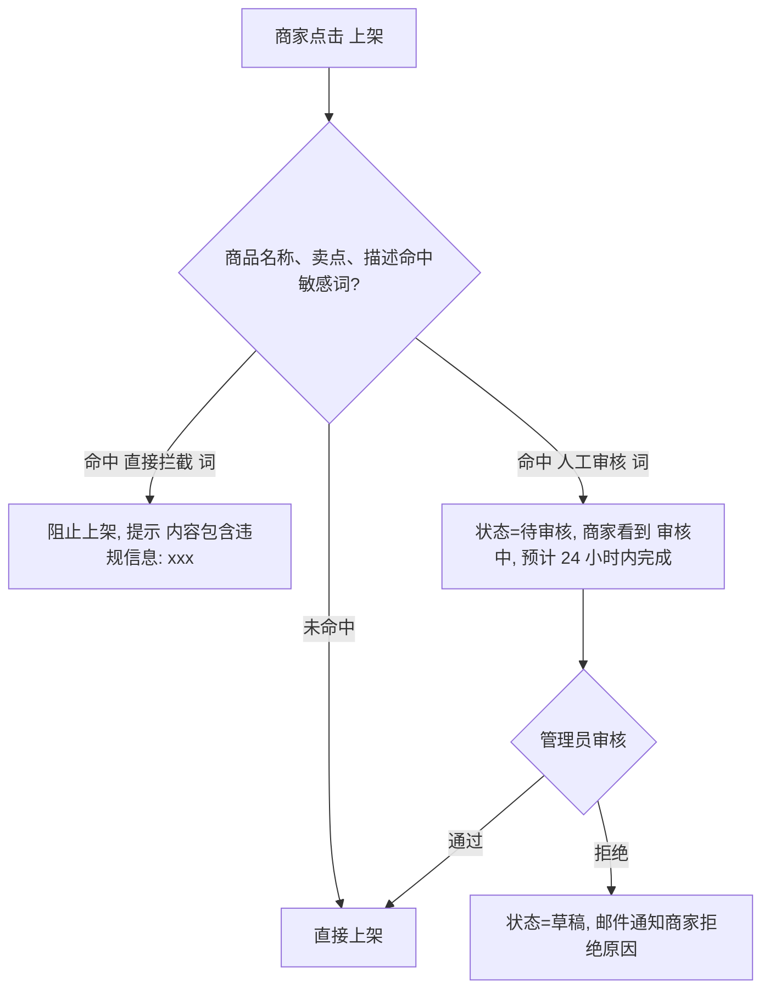
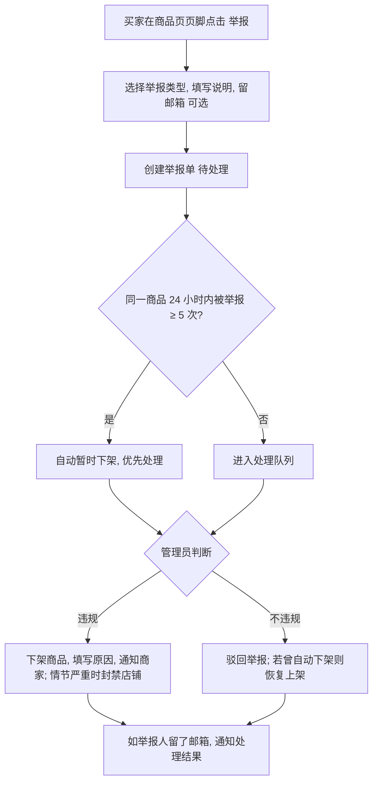

# 08 · 平台管理（ADM）

[← 返回总览](./README.md)

## 1. 模块概述
平台管理员使用的后台：管理商家、审核与下架商品、处理举报，维护平台内容合规。V1.0 只有一种管理员角色，不对外开放注册。

## 2. 功能清单

| 编号 | 功能 | 描述 | 优先级 |
|---|---|---|---|
| ADM-01 | 管理员登录 | 独立登录入口，强制两步验证（TOTP） | P0 |
| ADM-02 | 平台概览 | 商家数、商品数、订单数、GMV、待处理事项 | P1 |
| ADM-03 | 商家管理 | 列表、详情、封禁、解封 | P0 |
| ADM-04 | 商品审核与下架 | 敏感词命中商品审核；任意商品下架 | P0 |
| ADM-05 | 举报处理 | 买家举报商品，管理员处理 | P0 |
| ADM-06 | 禁售规则与敏感词库 | 维护敏感词，公开禁售规则页面 | P0 |
| ADM-07 | 申诉处理 | 商家对下架 / 封禁提出申诉 | P1 |
| ADM-08 | 系统配置 | 保留店铺链接、上传限制、限流阈值 | P1 |
| ADM-09 | 多角色权限 | 运营、客服、超级管理员 | P2 |

## 3. 禁售规则（ADM-06）
公开页面 `/rules`，商家注册时需同意。以下商品禁止在 MkClou 销售：

| 类别 | 示例 |
|---|---|
| 违法违规内容 | 色情、赌博、暴力、毒品、诈骗相关内容 |
| 侵犯知识产权 | 盗版软件、破解补丁、未经授权的影视 / 课程 / 书籍资源 |
| 账号与身份类 | **第三方平台账号的转售、出租、共享**（游戏、社交、AI 服务账号等）、实名认证服务 |
| 网络安全类 | 翻墙工具、黑客工具、攻击服务、恶意软件 |
| 个人信息类 | 个人信息数据、社工库 |
| 金融类 | 代刷、套现、虚拟货币交易 |
| 其他 | 法律法规禁止或平台认为有风险的商品 |

**敏感词库**：分为“直接拦截”和“进入人工审核”两级，管理员可在后台增删，修改后 1 分钟内生效（缓存刷新）。

## 4. 业务流程

### 4.1 商品审核（ADM-04）

### 4.2 举报处理（ADM-05）

举报类型：违法违规、侵权盗版、诈骗、货不对版、其他。

### 4.3 封禁商家（ADM-03）
- 封禁时必须选择原因并填写说明，记录审计日志。
- 封禁效果：商家所有会话立即失效，无法登录；店铺页显示“该店铺已关闭”；所有商品不可购买。
- **在途订单处理**：已支付但未交付的订单继续自动交付；已完成订单的交付页仍可访问（保护买家权益）。
- 解封：恢复登录与店铺，商品保持封禁前状态。

## 5. 页面与交互

### 5.1 管理员登录 `/admin/login`（ADM-01）
- 邮箱 + 密码 + 6 位 TOTP 动态码（Google Authenticator 等）。
- 首次登录强制绑定 TOTP。
- 连续失败 5 次锁定 30 分钟；所有登录行为记录审计日志。
- 管理后台会话 2 小时无操作自动登出。

### 5.2 商家管理 `/admin/merchants`
- 表格列：商家邮箱、店铺名（链接）、注册时间、邮箱验证、收款状态、商品数、订单数、累计 GMV、状态。
- 筛选：状态（正常 / 封禁）、注册时间；搜索：邮箱、店铺名、店铺链接。
- 详情页：基本信息、店铺信息、商品列表、最近订单、举报记录、操作日志；操作：封禁 / 解封。

### 5.3 商品管理 `/admin/products`
- Tab：待审核（显示数量）、全部、平台下架。
- 待审核列表中高亮显示命中的敏感词；可预览买家视角页面。
- 操作：通过、拒绝（填原因）、下架（填原因）、恢复。

### 5.4 举报处理 `/admin/reports`
- 列表：举报时间、商品、店铺、举报类型、说明、同商品举报次数、状态。
- 详情：举报内容、商品预览、该商品历史举报；操作：判定违规并下架 / 驳回。

## 6. 异常与边界

| 场景 | 处理 |
|---|---|
| 恶意举报（同一 IP 大量举报） | 同一 IP 每天最多举报 10 次；自动下架阈值只统计不同 IP 的举报 |
| 管理员误操作下架 | 可在“平台下架”Tab 中恢复，记录审计日志 |
| 商家被封禁时有退款需求 | 管理员可代为查看订单；退款需由商家在支付宝侧处理（平台不经手资金），管理员提供订单信息协助 |
| 审核超过 24 小时未处理 | 概览页待办事项标红提醒 |

## 7. 验收标准
- [ ] 管理员必须使用 TOTP 才能登录。
- [ ] 商品描述包含“人工审核”敏感词时进入待审核，审核通过后自动上架。
- [ ] 同一商品被 5 个不同 IP 举报后自动下架。
- [ ] 封禁商家后，该商家立即无法访问后台，已完成订单的买家仍可下载商品。
- [ ] 所有管理员操作都在审计日志中可查。
